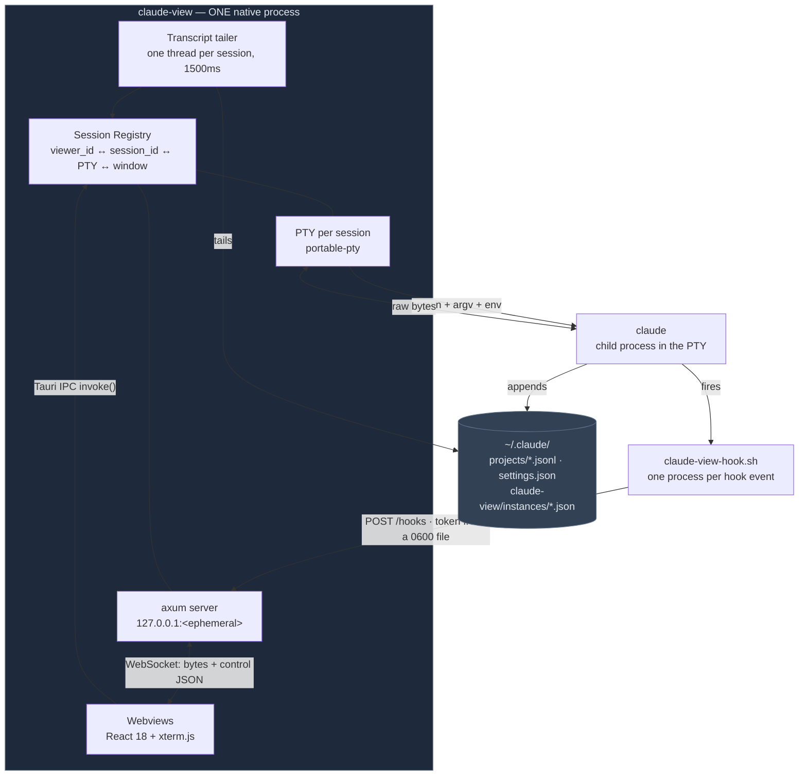

# claude-view

A desktop app that opens a **dedicated window for each Claude Code CLI session** and mirrors that
session's terminal **in real time, character-by-character** — every command, its live scrolling
output, and Claude's messages — beside a **panel that is the readable, costed record of everything
the session did**: the full trace, every subagent run, and what each turn cost.

The panel has two views:

| View | What it shows |
|---|---|
| **Stream** | Everything the session did: prompts, replies, thinking, tool calls with their full output, nested subagent runs, with **cost on each turn**. Searchable, filterable (`tools` reproduces the old command log), exportable to Markdown or JSON. Reads **newest-first while a session is live, oldest-first once it has ended** — the direction is derived from session state, not a setting. |
| **Agents** | Every subagent the session spawned — what it was asked to do, its type, model, status, tool count, duration and **notional cost**. Selecting one scopes the Stream to it; **`open ↗` opens that run in its own window** with its own trace, cost and export. |

Above the split sits the **agent strip**, mirroring Claude Code's own agent tree — `● main`, then a
chip per run with a live status dot and what it was asked to do. It appears only when a session has
actually spawned runs.

The launcher adds a **spend** rollup across every session on the machine — today, all time, split
by model, directory and day.

**Every dollar figure is notional**: what the tokens would have cost at published API list prices.
On a Claude subscription you are billed a flat rate, so these are not bills. Unpriced models show
their tokens and withhold dollars rather than guessing.

## Documentation

| | |
|---|---|
| **[Architecture — HLD & LLD](docs/ARCHITECTURE.md)** | The full design: the three-layer model and why it is forced, all 14 Rust modules and 25 TypeScript files, the 24 IPC commands, 8 HTTP routes and the WebSocket protocol, every on-disk format, eight runtime flows, and an honest list of what an audit found. 11 diagrams. |
| **[Interactive system diagram ↗](https://quantum-vik.github.io/claude-view/diagrams/architecture.html)** | The whole runtime in one picture — pan, zoom, search, guided views, export. Source: [`docs/diagrams/`](docs/diagrams/) |
| **[CONTEXT.md](CONTEXT.md)** | The domain glossary — run vs type, turn, replay, baseline, hosted vs watched, and what "live" is allowed to mean. |
| **[docs/agents/](docs/agents/)** | Agent-facing notes: the issue tracker, triage labels, domain conventions. |

## Permissions: sessions skip approval prompts by default

**Every session claude-view launches runs `claude --dangerously-skip-permissions` unless you turn
that off.** That has been true since the app's first commit. It is now a visible, per-session
choice instead of a hardcoded one — but the default is unchanged, so upgrading does not alter how
anything you already run behaves.

What the flag does: Claude Code stops asking you to approve tool calls. For the whole session,
Claude writes, edits and deletes files and runs shell commands immediately, without confirmation.
Nothing sits between the model deciding to run something and it running on your machine, in
whatever directory you pointed the session at.

**Turning it off.** The launcher has a **Skip permission prompts** toggle that applies to the next
session you start; the choice is remembered. With it off, the session gets Claude Code's normal
approval prompts. The setting is fixed once a session is running — it's a process argument, so
changing it means launching a new session. Sessions running with it on are tagged **skip perms**
in the launcher list, and every session reports `"skip_permissions": true|false` in the session
API. Terminal windows are unaffected: they run your login shell with your own privileges and have
no such flag (they always report `false`).

**Why a session can sit there looking idle.** With prompts skipped, a permission prompt is never
drawn, so nothing ever puts a session into the `blocked` state because of one. A quiet session
mid-task has already run the command — a stricter setup would have stopped there and asked you
first. That is the trade this default makes; the toggle is how you take the other side of it.

## How it works (the three layers)

Claude Code's observability channels (hooks, Agent SDK, `stream-json`, transcripts, OTel) only
emit tool output **after** a command finishes — none stream live output. So:

| Layer | Source | Latency |
|---|---|---|
| **Live terminal mirror** | `claude` spawned inside a PTY the app owns (`portable-pty`) → raw bytes → binary WebSocket → xterm.js | Instant, char-by-char |
| **Trace, cost, agent runs** | The session transcript on disk (`~/.claude/projects/…`), tailed — plus one file per subagent run | ~0.2s behind the event |
| **Session state** | Claude Code hooks → bundled bridge script → HTTP POST to the app's local server | Per-event |

The transcript owns the trace and all cost accounting, because it is the only source that sees a
subagent's work at all. Hooks stay for the two things a transcript cannot express: that a session
is **waiting on you**, and that a turn **ended**.

**One thing the panel cannot take from the terminal:** the output of a tool call *while it is
still running*. No channel carries it. Finished output the panel shows in full — including the
part the terminal truncates to three lines.

The app **launches** sessions (so it owns their terminals) and **observes** them (via hooks).
Multiple concurrent sessions each get their own native window, correlated by
`CLAUDE_VIEW_ID` (env, injected at spawn) ↔ `session_id` (from the `SessionStart` hook).

## Prerequisites

- **Rust** (stable, 1.77+) — https://rustup.rs
- **Node.js** 18+ and npm
- **Claude Code CLI** (`claude` on PATH; or set `CLAUDE_BIN=/full/path/to/claude`)
- Linux only: Tauri v2 system deps (webkit2gtk 4.1, etc.) — see https://v2.tauri.app/start/prerequisites/

## Run (dev)

```bash
cd claude-view
npm install
npm run tauri dev
```

The launcher window opens. Click **New Session**, pick a working directory, and a session window
opens running `claude --dangerously-skip-permissions` (the default — see
[Permissions](#permissions-sessions-skip-approval-prompts-by-default)) with a live terminal
mirror. The session is fully interactive from the window — type into it exactly as you would in a
terminal.

## Build (release)

```bash
npm run tauri build
```

Installers/bundles land in `src-tauri/target/release/bundle/`.
(The bundled icon is a placeholder; replace `src-tauri/icons/icon.png` — and add an `.icns`/`.ico`
via `npx tauri icon` — before shipping.)

## Enable session state (hooks)

The live terminal, the trace, cost and the agent roster all work with **no setup** — they read the
transcript Claude Code already writes. Hooks add one thing on top: knowing when a session is
waiting on you rather than working.

1. In the launcher window, click **Install** under *Hooks* (asks nothing else; it's reversible).
   This:
   - writes the bridge script to `~/.claude/claude-view/claude-view-hook.sh` (`.ps1` on Windows), and
   - merges entries for all seven hook events — `SessionStart`, `UserPromptSubmit`, `PreToolUse`,
     `PostToolUse`, `SessionEnd`, `Stop`, `Notification` — into `~/.claude/settings.json`,
     **preserving any existing hooks** (a one-shot 0600 backup is written to
     `settings.json.claude-view.bak`, once and only once).

   `UserPromptSubmit` is load-bearing: without it, a turn that thinks for 90 seconds before touching
   a tool is indistinguishable from an idle session.
2. **Uninstall** removes exactly those entries and the script, nothing else.

The bridge script is a no-op when `CLAUDE_VIEW_ID` is unset, so sessions started outside
claude-view are completely unaffected. It fires a `curl` with a 2s timeout in the background and
always exits 0, so it can never block Claude Code. The payload is piped via stdin (not a CLI
argument), so large tool outputs are never truncated by `ARG_MAX`.

**Security note:** the auth token is *not* injected into the session's environment (it would be
readable by every process Claude spawns). The bridge script reads it from the 0600
`~/.claude/claude-view/instances/<port>.json` instead — one file per port, so two running instances
can never clobber each other's hook delivery. **If you installed hooks before this change, click
Install again** to refresh the bridge script — otherwise the old script can't authenticate and the
session state stays `unknown`.

## Using it

- **New Session** → directory picker → new window running `claude` in that cwd. By default that is
  `claude --dangerously-skip-permissions`; the **Skip permission prompts** toggle next to the
  launcher's session controls decides, and it applies to **Resume in viewer** too. Read
  [Permissions](#permissions-sessions-skip-approval-prompts-by-default) before leaving it on.
- **Resume in viewer** → directory picker → runs `claude --continue` (most recent conversation in
  that directory) or `claude --resume <id>` if you paste a session id. This is how you bring an
  *existing* session into the viewer: the app can only mirror terminals it owns, so live-attaching
  to a session running in another terminal isn't possible — exit it there, then resume it here
  with full history.
- Each Bash/tool call Claude makes appears in the sidebar as an amber *running* card that resolves
  to green *success* / red *error* with a duration (requires hooks installed).
- **Cmd/Ctrl+F** in a session window: search the terminal scrollback.
- When `claude` exits, the window shows an **ENDED** badge and keeps the scrollback visible.
- Closing a session window does not kill the session's PTY; reopen/focus from the launcher list
  (the last 2 MB of output replays on reconnect).

## Architecture

<picture>
  <source media="(prefers-color-scheme: dark)" srcset="docs/diagrams/architecture-dark.png">
  
</picture>

<p align="center">
  <b><a href="https://quantum-vik.github.io/claude-view/diagrams/architecture.html">↗ Open the interactive version</a></b>
  &nbsp;·&nbsp; pan, zoom, search, three guided views, PNG/SVG export
</p>

One OS process hosts everything: the Rust backend, the loopback server, every PTY child, and every webview.
Windows are **not** separate processes.



**claude-view only ever reads Claude Code's transcripts. It never writes them.**

### Hosted vs watched sessions

One discriminator runs through the whole backend — `Session.pty: Option<Pty>`:

| | **Hosted** | **Watched** |
|---|---|---|
| Origin | claude-view launched it | started in a terminal elsewhere |
| Live bytes | yes, from the PTY reader thread | none — there is no process |
| Input / resize / kill | real | silent no-ops |
| Hook events | yes | none — the bridge no-ops without `CLAUDE_VIEW_ID` |
| Liveness | pushed (process exit is authoritative) | **polled** from the transcript |
| Read-only | no | **by construction, not by policy** |

The four live handles are grouped into one `Pty` struct so a half-attached session is unrepresentable, and
`SessionInfo.watched` is *derived* from `pty.is_none()` rather than stored, so it cannot drift.

### Windows

There is exactly one HTML file, and **the URL query string is the route** — resolved once at load, with no router
library and no navigation afterward:

| Query string | Root component | Window label |
|---|---|---|
| *(no `vid`)* | `Launcher` | `main` |
| `?vid&port&token&cwd` | `SessionWindow` | `session-<vid>` |
| `…&kind=terminal` | `TerminalWindow` | `session-<vid>` |
| `…&watched=1` | `SessionWindow` (read-only) | `session-<vid>` |
| `…&kind=agent&agent=<id>` | `AgentWindow` | `agent-<vid>-<agent_id>` |

When the launcher is ≥1100 px wide it mounts those same components **inline as tabs** in a tmux-like pane grid.
Hidden panes are `display:none`, never unmounted — which is why a tab switch never makes a terminal reconnect.

### The local server

Eight routes on `127.0.0.1:<ephemeral>`, **every one token-authed**:

| Route | Purpose |
|---|---|
| `GET /ws/:id` | The live spine: binary = PTY bytes, text = control JSON. Auth via `?token=` only |
| `POST /hooks` | Every Claude Code hook event, from the bridge script |
| `POST /bind` | Explicit binding for custom bridges (`/hooks` binds implicitly) |
| `GET`/`POST /sessions`, `POST /terminals` | List and launch, for scripting |
| `GET /past_sessions` | The `~/.claude/projects` scan |
| `GET /trace/:id`, `GET /changes/:id` | Paged trace and the git-derived change set |

**The webview does not use this server** (except the WebSocket): it talks to the backend over Tauri IPC — 24
commands — because the webview is a different origin from `127.0.0.1:<port>` and there is deliberately no CORS
layer. `src/` contains zero `fetch()` calls.


## Implementation notes / chosen defaults

Where the spec was silent (or allowed a choice), these defaults were picked:

- **Event transport:** pushed as JSON **text frames on the same WebSocket** as the PTY bytes
  (binary = bytes, text = control) instead of a second WS channel or Tauri emit — one connection,
  no framing ambiguity.
- **Bridge normalization:** the bridge script forwards the hook's stdin JSON **verbatim** with
  `X-Claude-View-Id` / `X-Claude-View-Token` headers; normalization happens server-side in Rust.
  This keeps the shell script dependency-free (no `jq`). `SessionStart` binds via `/hooks`
  directly; `/bind` also exists per the spec contract for custom bridges.
- **Bridge script location:** installed to `~/.claude/claude-view/` (not the app bundle dir) so
  the `settings.json` entry survives app moves/updates and works identically in dev and release.
- **Auth:** a per-app-run UUID token is required on `/hooks`, `/bind`, and the WebSocket
  (`?token=`); the server binds to `127.0.0.1` only.
- **Pre/Post correlation:** by `tool_use_id` when the hook payload provides it, else FIFO per
  tool name. Duration = server receipt-time delta between Pre and Post.
- **Success detection:** hook payloads carry no stable success flag across versions, so
  `tool_response` is inspected defensively (`is_error`, `success:false`, `error`), defaulting to
  success.
- **Scrollback replay:** the server keeps the last 2 MB of PTY output per session and replays it
  on WS (re)connect, so refreshed/reopened windows aren't blank.
- **`SessionStart`/`SessionEnd` hook entries omit `matcher`** (lifecycle events match all sources
  that way); `PreToolUse`/`PostToolUse` use `"matcher": "*"` per the spec.
- **Permission mode:** sessions default to `--dangerously-skip-permissions`, per-session
  overridable, reported as `skip_permissions` on every session. The default is kept as-is because
  changing it would silently alter the security posture of an existing install; see
  [Permissions](#permissions-sessions-skip-approval-prompts-by-default) for what it costs you.
- **claude discovery:** `CLAUDE_BIN` env override, then PATH, then common install dirs
  (`/opt/homebrew/bin`, `/usr/local/bin`, `~/.local/bin`, `~/.claude/local`).
- **Session windows** get their config via URL query params (`vid`, `port`, `token`, `cwd`).
- **Scripting affordances** (added beyond the spec, used by the e2e smoke tests):
  - `CLAUDE_VIEW_TOKEN` env var fixes the auth token instead of a random per-run UUID.
  - `POST /sessions` `{"cwd": "..."}` (token-authed, localhost) launches a session + window
    from the CLI: the response returns the `viewer_id`. Add `"skip_permissions": false` for a
    session that asks before running tools; **omitting the key means `true`**, matching the app's
    default. A present-but-non-boolean value is a 400, not a guess in either direction.

## Project layout

```
claude-view/
├─ src-tauri/                       Rust backend — 11,276 lines, 14 modules, 162 tests
│  ├─ src/main.rs          1014     Tauri setup · 24 #[tauri::command] · every window
│  ├─ src/server.rs        1692     axum routes + the WebSocket protocol (~810 lines are tests)
│  ├─ src/session.rs       1186     Session · Pty · Registry · AgentState · UsageLedger · timeline
│  ├─ src/agents.rs        1041     the agent-run roster, cost partition, run status
│  ├─ src/transcript.rs    1023     locate · subagent discovery · incremental tail · TokenUsage
│  ├─ src/pty.rs            722     claude discovery · argv · PTY spawn · 3 threads + the tailer
│  ├─ src/trace.rs          713     paged Entry reader, multi-file Cursor, typed absence
│  ├─ src/changes.rs        642     baseline · change set · commit spans · patch (git subprocess)
│  ├─ src/instance.rs       607     0600 discovery files (majority test code)
│  ├─ src/rollup.rs         517     cross-session spend, de-duplicated across transcripts
│  ├─ src/export.rs         502     whole-trace export to Markdown / JSON
│  ├─ src/hooks_install.rs  498     settings.json merge/remove + bridge script install
│  ├─ src/past_sessions.rs  498     ~/.claude/projects scan → launcher rows
│  ├─ src/liveness.rs       329     watched-session liveness from the transcript alone
│  ├─ src/git.rs            292     repo identity by walking .git — no subprocess
│  └─ scripts/                      claude-view-hook.sh / .ps1 — embedded via include_str!
│
├─ src/                             React + TS frontend — 21,098 lines, no framework, no store
│  ├─ main.tsx               32     entry: initTheme(), then pick ONE of four roots by query string
│  ├─ Launcher.tsx         2624     main window: browser, past sessions, hooks, spend, tabs + pane grid
│  ├─ SessionWindow.tsx    1351     header · AgentStrip · panel · terminal · notification policy
│  ├─ Trace.tsx            1211     the Stream: every kind, nested runs, cost per turn, export
│  ├─ themes.ts            1106     theme engine + VS Code theme importer
│  ├─ Terminal.tsx          796     xterm.js + 4 addons + WS + scroll roller + detectDialog()
│  ├─ Agents.tsx            545     the run roster table + useRoster (the shared poller)
│  ├─ Changes.tsx           437     grouped, churn-ranked file list + lazy per-file diff
│  ├─ Spend.tsx             315     machine-wide spend rollup
│  ├─ AgentWindow.tsx       239     one agent run, read-only, in its own window
│  ├─ pricing.ts            198     THE price table, with its AS_OF date — the only place dollars exist
│  ├─ tokens.ts             109     the T object — every value a var(--cv-*) reference
│  └─ ui/                   160     Button · Stat · EmptyState — the only shared primitives
│
├─ docs/
│  ├─ ARCHITECTURE.md               ← the full HLD + LLD
│  ├─ diagrams/architecture.html    ← the interactive system diagram
│  └─ agents/                       issue tracker, triage labels, domain notes, handoff
├─ packaging/                       .deb / .AppImage / two Arch PKGBUILDs / the bwrap sandbox wrapper
├─ prototypes/                      throwaway UI prototypes, rebuilt from your own corpus
├─ CONTEXT.md                       the domain glossary — run vs type, turn, baseline, notional cost
└─ justfile                         build · lint · test · ci · package   (CI runs `just ci`)
```

## Development

```bash
just build     # npm ci + tsc + vite build → dist/   (a hard prerequisite of every cargo command)
just lint      # tsc --noEmit, cargo fmt --check, cargo clippy --all-targets -- -D warnings
just test      # cargo test --locked — 162 tests
just ci        # all three; this is exactly what GitHub Actions runs
just dev       # npm run tauri dev
just package   # .deb + .AppImage into src-tauri/target/release/bundle/
```

`tauri.conf.json` points `frontendDist` at `../dist`, and `dist/` is gitignored — so on a clean checkout **no cargo
command works at all** until the frontend has been built. That is why `build` gates everything.

## Running it sandboxed

Sessions default to `--dangerously-skip-permissions`. `packaging/sandbox/claude-view-sandboxed` is a `bwrap`
wrapper that replaces your entire home directory with a tmpfs and binds back exactly three things — `~/.claude`,
`~/.claude.json`, and the one workspace directory you name:

```bash
packaging/sandbox/claude-view-sandboxed ~/code/my-project
```

Measured effect: home-directory entries visible to the app go from 51 to 4; sibling repositories are unreachable.
