# claude-view — Architecture

**High-level and low-level design of a Tauri v2 desktop app that mirrors Claude Code CLI sessions.**

Version 1.6.0 · Rust 2021 + React 18 · ~11,300 lines of Rust across 14 modules, ~21,100 lines of TypeScript across 25 files, 162 Rust tests.

### The diagram set

Five interactive diagrams — pan, zoom, search, guided views, PNG/SVG export. Each ships with the `.spec.json` it was generated from, so it can be regenerated or diffed rather than redrawn.

| | Diagram | Answers |
|---|---|---|
| **HLD** | [System architecture ↗](https://quantum-vik.github.io/claude-view/diagrams/architecture.html) | What runs where, and what sits outside the process |
| **HLD** | [How a session becomes each view ↗](https://quantum-vik.github.io/claude-view/diagrams/hld-dataflow.html) | Produce → capture → read → derive → present, and why three paths |
| **LLD** | [The read path ↗](https://quantum-vik.github.io/claude-view/diagrams/lld-read-path.html) | Nine modules over one set of files, and the two leaves |
| **LLD** | [The frontend ↗](https://quantum-vik.github.io/claude-view/diagrams/lld-frontend.html) | One bundle, four roots, three transports |
| **LLD** | [Session state ↗](https://quantum-vik.github.io/claude-view/diagrams/lld-session-state.html) | Two signals merged, and what may say a session ended |

| | |
|---|---|
| **[1. High-level design](#1-high-level-design)** | what the system is, why it is shaped this way, the three-layer model |
| **[2. Tech stack](#2-tech-stack)** | every dependency and why it is there |
| **[3. Structure](#3-structure)** | the component map, the module graph, the repository layout |
| **[4. Low-level design — backend](#4-low-level-design--backend)** | all 14 Rust modules, type by type |
| **[5. Low-level design — frontend](#5-low-level-design--frontend)** | all 25 TypeScript files, component by component |
| **[6. The interface catalogue](#6-the-interface-catalogue)** | 24 IPC commands, 8 HTTP routes, the WebSocket protocol |
| **[7. Data model](#7-data-model)** | on-disk formats and every shape that crosses a boundary |
| **[8. Runtime flows](#8-runtime-flows)** | eight end-to-end sequences |
| **[9. Cross-cutting design rules](#9-cross-cutting-design-rules)** | the rules that recur everywhere, and the measurements behind them |
| **[10. Build, test, package, release](#10-build-test-package-release)** | the pipeline |
| **[11. Known gaps](#11-known-gaps)** | what an audit of this codebase actually found |

---

## 1. High-level design

### 1.1 The problem

Claude Code is a CLI. You watch it work in a terminal, where the transcript scrolls past, tool output is truncated to three lines, subagent runs are invisible, and nothing tells you what any of it cost. claude-view opens **a dedicated native window per session** that mirrors that terminal character-by-character while showing, beside it, a readable and costed record of everything the session did.

The design constraint that shapes the entire system is this:

> **Claude Code's observability channels — hooks, the Agent SDK, `stream-json`, transcripts, OTel — all emit tool output only *after* a command finishes. None of them stream live output.**

So a faithful live mirror cannot be built from any official channel. It has to come from owning the terminal itself. That single fact produces the app's three-layer architecture.

### 1.2 The three-layer model

<picture>
  <source media="(prefers-color-scheme: dark)" srcset="diagrams/hld-dataflow-dark.png">
  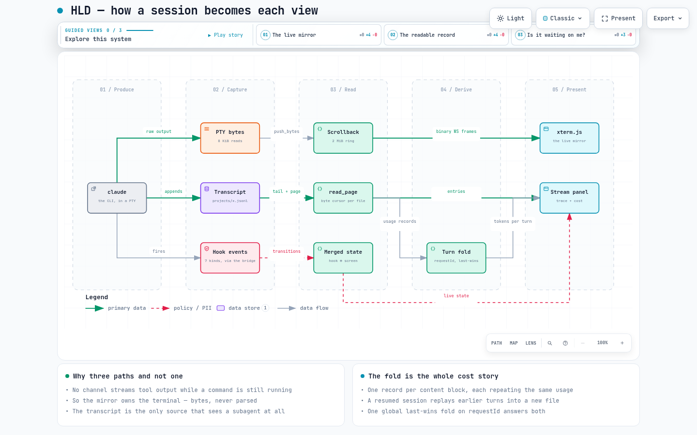
</picture>

*Each layer answers a question no other layer can, at a latency the others cannot match* — **[open the interactive version ↗](https://quantum-vik.github.io/claude-view/diagrams/hld-dataflow.html)**


Each layer answers a question no other layer can, at a latency the others cannot match:

| Layer | Source | Carries | Latency |
|---|---|---|---|
| **Live terminal mirror** | `claude` spawned inside a PTY the app owns (`portable-pty`) → raw bytes → binary WebSocket → xterm.js | Every byte the terminal would show, as it appears | Instant, char-by-char |
| **Trace, cost, agent runs** | Claude Code's own transcript on disk (`~/.claude/projects/…`), tailed incrementally — plus one file per subagent run | The complete readable record: prompts, replies, thinking, full tool output, nested runs, tokens | ~0.135–0.244 s behind the event |
| **Session state** | Claude Code hooks → a bundled bridge script → authenticated HTTP POST to the app's loopback server | Turn boundaries, and whether a session is *waiting on you* | Per-event |

**The transcript owns the trace and all cost accounting**, because it is the only source that sees a subagent's work at all. **Hooks stay for the two things a transcript cannot express**: that a session is blocked waiting on a human, and that a turn ended.

There is a fourth signal that belongs to neither: **the rendered screen**. Hooks are blind to dialogs — a session parked on *"Do you trust this folder?"* fires no hook and would report idle forever. Only the viewer, which has a fully parsed xterm.js grid, can see it. So the frontend scans the screen and reports dialogs back over the WebSocket, and the backend merges that with the hook state. See [§9.4](#94-two-signals-merged-never-mixed).

**One thing no layer can supply:** the output of a tool call *while it is still running*. No channel carries it. Finished output the panel shows in full, including the part the terminal truncated.

### 1.3 System context

<picture>
  <source media="(prefers-color-scheme: dark)" srcset="diagrams/architecture-dark.png">
  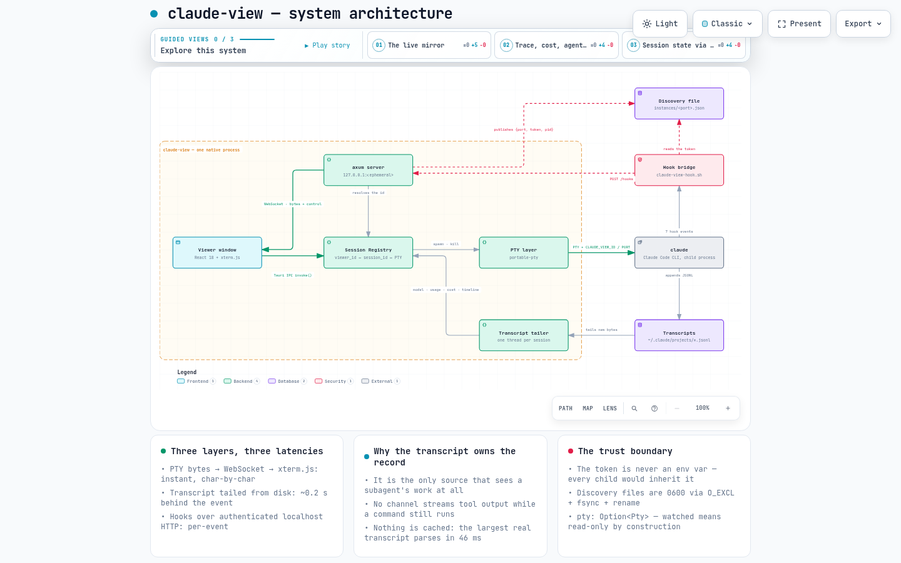
</picture>

*The whole runtime. Everything inside the boundary is one OS process* — **[open the interactive version ↗](https://quantum-vik.github.io/claude-view/diagrams/architecture.html)**


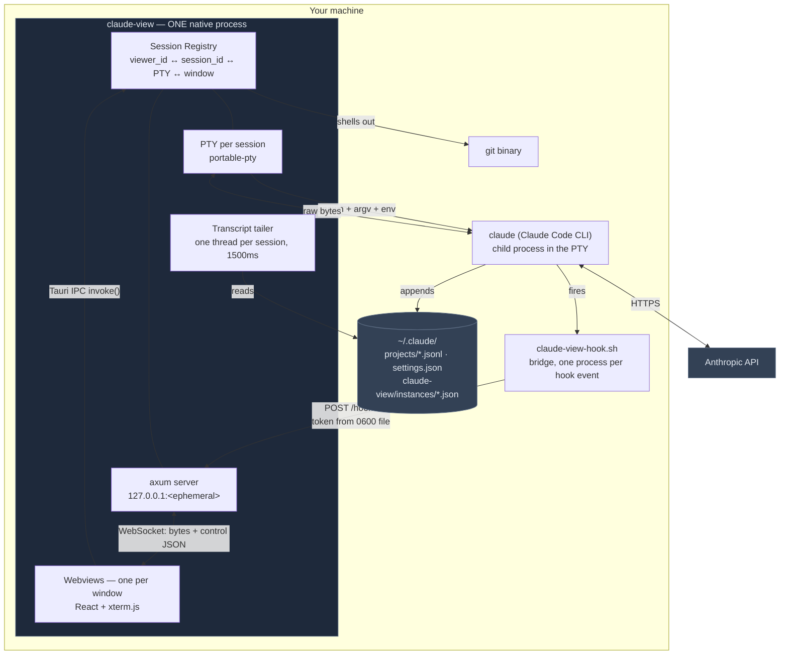

**claude-view only ever reads Claude Code's transcripts. It never writes them.** The only files it writes are its own discovery files, the hook bridge script, the hook entries it merges into `settings.json`, and exports you explicitly ask for.

### 1.4 Process and window model

One OS process hosts everything: the Rust backend, the axum server, every PTY child, and every webview. Windows are **not** separate processes.

There is exactly one HTML file. `index.html` is loaded by every window, and **the URL query string is the route** — resolved once at module load, with no router library and no navigation afterward:

| Query string | Root component | Window label | Size |
|---|---|---|---|
| *(no `vid`)* | `Launcher` | `main` | 520×640 |
| `?vid&port&token&cwd` | `SessionWindow` | `session-<vid>` | 1160×740 |
| `…&kind=terminal` | `TerminalWindow` | `session-<vid>` | 1000×680 |
| `…&watched=1` | `SessionWindow` (read-only) | `session-<vid>` | 1160×740 |
| `…&kind=agent&agent=<id>` | `AgentWindow` | `agent-<vid>-<agent_id>` | 1000×720 |

Only the launcher is declared in `tauri.conf.json`; every other window is built imperatively in Rust. Window labels form a namespace with meaning — looking one up by label is what makes *focus-instead-of-duplicate* work.

**Windows are also components.** When the launcher is ≥1100 px wide and has connection info, it switches to *embed mode* and mounts the very same `SessionWindow` / `TerminalWindow` inline as Chrome-style tabs in a tmux-like pane grid (1 / 2-col / 2-row / 2×2). Hidden panes are `display:none`, **never unmounted and never reparented** — which is exactly what lets a tab switch or a layout change happen without a terminal reconnecting and replaying its scrollback. Popping a tab into a native window and docking it back moves the *view*; the PTY never stops.

### 1.5 Hosted vs watched sessions

A single discriminator runs through the whole backend: `Session.pty: Option<Pty>`.

| | **Hosted** | **Watched** |
|---|---|---|
| Origin | claude-view launched it | started in a terminal elsewhere |
| `pty` | `Some(Pty { writer_tx, master, killer, bytes_tx })` | `None` |
| Live bytes | yes, from the PTY reader thread | none — there is no process |
| Input / resize / kill | real | silent no-ops |
| Hook events | yes (`CLAUDE_VIEW_ID` was injected) | none — the bridge no-ops |
| Liveness | pushed (process exit is authoritative) | **polled** from the transcript |
| Read-only | no | **by construction, not by policy** |

The four live handles are grouped into one `Pty` struct precisely so a half-attached session is unrepresentable, and `SessionInfo.watched` is *derived* from `pty.is_none()` rather than stored, so it cannot drift.

### 1.6 Trust and security boundaries

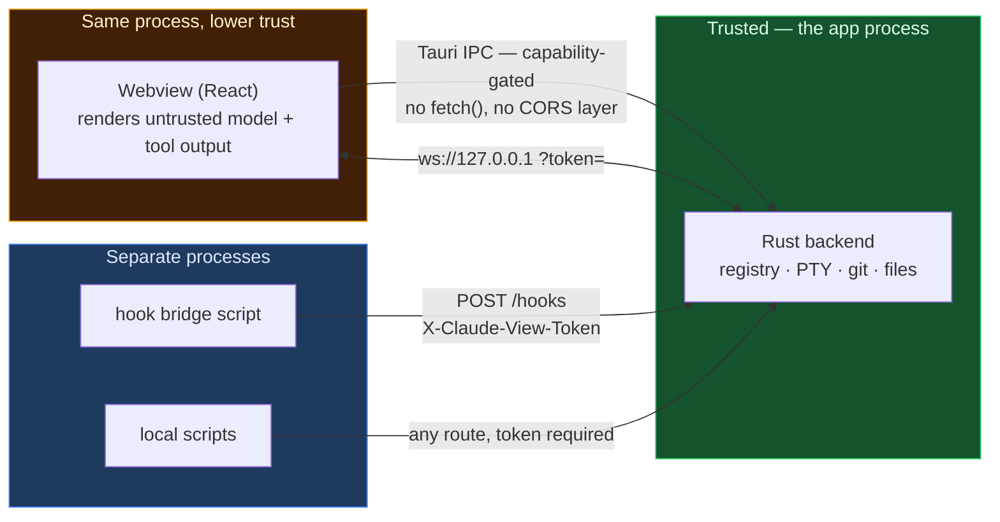

Five rules define the boundary:

1. **Localhost-only, one shared bearer token, checked on every route.** There is no unauthenticated endpoint. The token can `POST /sessions` and therefore spawn processes, so it is a full-control credential.
2. **The token never enters an environment variable.** Children get `CLAUDE_VIEW_ID` and `CLAUDE_VIEW_PORT` only. An env var is inherited by *every* process Claude spawns and is readable via `env` or `/proc/<pid>/environ`. The bridge reads the token from a `0600` discovery file instead.
3. **Discovery files are `0600` from the instant they exist,** inside a `0700` directory: written to a hidden temp sibling opened `O_CREAT|O_EXCL|0600`, fsync'd, then renamed. This closes the umask window that `fs::write` + `chmod` leaves open, refuses to follow a symlink planted at either path, and is atomic for concurrent readers.
4. **No CORS layer, deliberately.** The webview is a different origin from `127.0.0.1:<port>`, so it uses Tauri IPC — not `fetch`. `src/` contains zero `fetch` or `XMLHttpRequest` calls. The HTTP server exists for the hook bridge and for scripting.
5. **The frontend never gets a write-any-file capability.** `export_trace` writes the file in Rust and returns only `{path, bytes, entries, turns}`. `open_path` canonicalizes, refuses non-regular and executable files, prefers `code -g` (which can only ever *display* a file), and hands the OS opener only an allowlist of inert extensions — hardening against crafted terminal output, since an OSC 8 link can spoof its visible text.

> ### ⚠️ The security posture you are actually running
>
> **Every session claude-view launches runs `claude --dangerously-skip-permissions` unless you turn that off.** This has been true since the first commit. It is now a visible per-session toggle rather than a hardcoded constant, but **the default is unchanged**, because changing it would silently alter the security posture of every existing install.
>
> With the flag on, Claude Code never asks you to approve a tool call. It writes, edits and deletes files and runs shell commands immediately, in whatever directory you pointed the session at. The **Skip permission prompts** toggle in the launcher takes the other side of that trade; it applies to the next session you start, because it is a process argument and cannot change under a running process.
>
> `packaging/sandbox/claude-view-sandboxed` is the containment answer: a `bwrap` wrapper that replaces your entire home directory with a tmpfs and binds back exactly three things — `~/.claude`, `~/.claude.json`, and the one workspace directory you name. See [§10.4](#104-the-sandbox-wrapper).

---

## 2. Tech stack

### Backend — Rust 2021, crate `claude-view` 1.6.0

| Crate | Version | Why it is here |
|---|---|---|
| `tauri` | 2 | The desktop shell: windows, IPC, capabilities, bundling |
| `tauri-plugin-dialog` | 2 | Native directory picker and save dialog |
| `tauri-plugin-notification` | 2 | Desktop notifications that activate claude-view when clicked |
| `axum` | 0.7 *(+`ws`)* | The loopback HTTP + WebSocket server |
| `tokio` | 1 *(full)* | Async runtime behind axum |
| `portable-pty` | 0.8 | ConPTY on Windows, `openpty` on Unix — one API |
| `serde` / `serde_json` | 1 | **`preserve_order` is load-bearing**: a `BTreeMap` would alphabetize the user's entire `settings.json` |
| `uuid` | 1 *(v4)* | Viewer ids and the per-run auth token |
| `dirs` | 5 | `~` resolution across platforms |
| `parking_lot` | 0.12 | The many small `RwLock`s in the session model |
| `urlencoding` | 2 | Percent-encoding `cwd` into window URLs |
| `futures-util` | 0.3 | WebSocket sink/stream splitting |
| `open` | 5 | Hands a path or URL to the OS handler, with no shell parsing |
| `trash` | 5 | Deleting a past session moves it to the OS Trash, recoverable |
| `libc` | 0.2 *(unix only)* | Exactly one question: `kill(pid, 0)` for stale-instance reaping — chosen over pulling in `sysinfo` for one syscall |

`[profile.release]` sets `strip = true` and `lto = true`. There are **no `[dev-dependencies]`** — tests build scratch directories from `std::env::temp_dir()` keyed by pid rather than take a `tempfile` dependency.

### Frontend — React 18 · TypeScript 5.6 strict · Vite 6

| Package | Why |
|---|---|
| `react` / `react-dom` 18.3 | The UI |
| `@xterm/xterm` 5.5 | The terminal emulator |
| `@xterm/addon-fit` | Size the grid to the container |
| `@xterm/addon-search` | ⌘/Ctrl+F in the scrollback |
| `@xterm/addon-webgl` | GPU rendering, in a try/catch with canvas fallback and context-loss disposal |
| `@xterm/addon-unicode11` | Activated to version `"11"` so nerd-font glyph widths match tmux's column maths |
| `@tauri-apps/api` | `invoke()` and the event listener |
| `@tauri-apps/plugin-dialog` | `open()` for cwd pickers, `save()` for exports |

**No UI framework, no CSS framework, no component library, no state-management library, no router.** That is a decision, not an omission — see [§5.2](#52-styling-no-framework-on-purpose) and [§5.3](#53-state-no-store-on-purpose).

Fonts are vendored offline in `public/fonts/`: **Lora** (serif) and **IBM Plex Mono**. There is no webfont CDN and no telemetry.

---

## 3. Structure

### 3.1 Module dependency graph

<picture>
  <source media="(prefers-color-scheme: dark)" srcset="diagrams/lld-read-path-dark.png">
  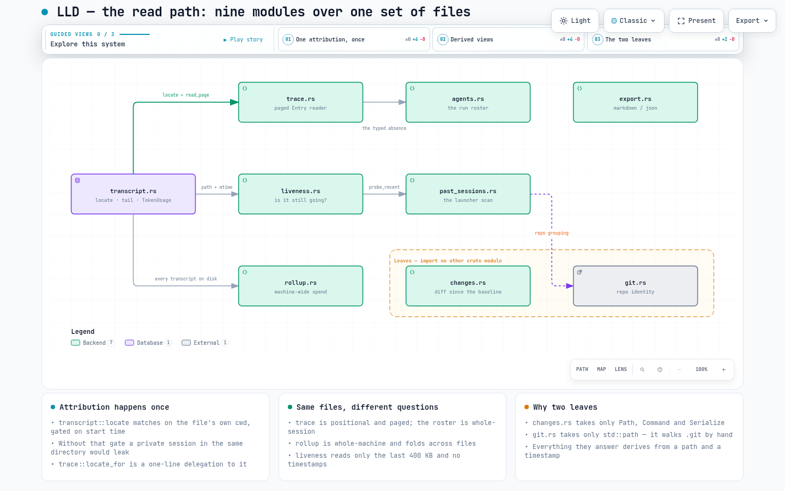
</picture>

*Nine modules reading one set of files. `changes.rs` and `git.rs` import no other crate module* — **[open the interactive version ↗](https://quantum-vik.github.io/claude-view/diagrams/lld-read-path.html)**


`main.rs` declares exactly **14** modules. The graph is close to a DAG with two deliberate leaves:

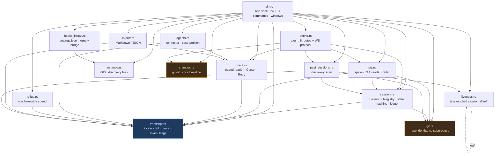

**`changes.rs` and `git.rs` are leaves.** Neither imports any other crate module — `changes.rs` takes only `serde::Serialize`, `std::path::Path` and `std::process::Command`; `git.rs` takes only `std::path`. Everything about the Changes view is a pure function of `(cwd, spawned_at_ms)` plus the repo on disk. `liveness.rs` is likewise a leaf apart from a test helper.

**`transcript.rs` is the hub.** Locating a session's file is a privacy-critical decision made exactly once, in `transcript::locate`, and every other consumer — the pager, the roster, the exporter, the liveness probe, the change-set baseline — inherits that one attribution rather than re-deriving it. `trace::locate_for` is a one-line delegation to it, specifically so a paged read and a live push can never disagree about which file a session owns.

### 3.2 Repository layout

```
claude-view/
├─ src-tauri/                       Rust backend (11,276 lines, 162 tests)
│  ├─ src/main.rs          1014     Tauri setup · 24 #[tauri::command] · all window building
│  ├─ src/server.rs        1692     axum routes + the WebSocket protocol (~810 lines are tests)
│  ├─ src/session.rs       1186     Session · Pty · Registry · AgentState · UsageLedger · timeline
│  ├─ src/agents.rs        1041     agent-run roster, cost partition, run status
│  ├─ src/transcript.rs    1023     locate · subagent discovery · incremental tail · TokenUsage
│  ├─ src/pty.rs            722     claude discovery · argv · PTY spawn · writer/reader/waiter + tailer
│  ├─ src/trace.rs          713     paged Entry reader, multi-file Cursor, typed absence
│  ├─ src/changes.rs        642     baseline · change set · commit spans · patch  (git subprocess)
│  ├─ src/instance.rs       607     0600 discovery files  (majority test code: 16 tests)
│  ├─ src/rollup.rs         517     cross-session spend, de-duplicated across transcripts
│  ├─ src/export.rs         502     whole-trace export to Markdown / JSON
│  ├─ src/hooks_install.rs  498     settings.json merge/remove + bridge script install
│  ├─ src/past_sessions.rs  498     ~/.claude/projects scan → launcher rows
│  ├─ src/liveness.rs       329     watched-session liveness from the transcript alone
│  ├─ src/git.rs            292     repo identity by walking .git — no subprocess
│  ├─ scripts/              ~96     claude-view-hook.sh (53) / .ps1 (43) — embedded via include_str!
│  └─ capabilities/default.json     the single capability set
│
├─ src/                             React + TS frontend (21,098 lines, 0 tests)
│  ├─ main.tsx               32     entry: initTheme() then pick ONE of four roots by query string
│  ├─ Launcher.tsx         2624     main window: browser, past sessions, hooks, spend, embedded tabs + pane grid
│  ├─ SessionWindow.tsx    1351     header · AgentStrip · panel (Stream/Agents/Changes) · terminal · notifications
│  ├─ Trace.tsx            1211     the Stream: every kind, nested runs, cost per turn, export
│  ├─ themes.ts            1106     theme engine + VS Code theme importer (most of it is the preset table)
│  ├─ Terminal.tsx          796     xterm.js + 4 addons + WS + scroll roller + detectDialog()
│  ├─ Agents.tsx            545     the run roster table + useRoster (the shared poller)
│  ├─ Changes.tsx           437     grouped, churn-ranked file list + lazy per-file diff
│  ├─ Spend.tsx             315     machine-wide spend rollup
│  ├─ ThemeMenu.tsx         269     ◐ popover, VS Code import
│  ├─ AgentWindow.tsx       239     one agent run, read-only, its own window
│  ├─ AgentStrip.tsx        238     ● main / ○ run chips above the split
│  ├─ TerminalWindow.tsx    191     PTY mirror minus everything Claude-specific
│  ├─ agents.ts             201     roster pricing + presentation
│  ├─ pricing.ts            198     THE price table, with its AS_OF date
│  ├─ cost.ts               146     live-rollup pricing
│  ├─ Resizer.tsx           127     pointer-captured drag handle
│  ├─ ws.ts                 121     the only WebSocket client
│  ├─ tokens.ts             109     the T object — every value a var(--cv-*) reference
│  ├─ ContextMeter.tsx       91     the context-window bar
│  ├─ models.ts              86     model/effort catalogue (NOT a pricing source)
│  ├─ events.ts              36     the TimelineEvent wire type (types only)
│  └─ ui/                   160     Button · Stat · EmptyState — the only shared primitives
│
├─ packaging/                       .deb / .AppImage / two Arch PKGBUILDs / the bwrap wrapper
├─ prototypes/                      throwaway single-file HTML prototypes, rebuilt from your own corpus
├─ scripts/                         dev.sh · reinstall.sh (macOS) · demo-timeline.sh
├─ docs/                            published to GitHub Pages from this directory
│  ├─ ARCHITECTURE.md               this file
│  ├─ index.html                    the Pages landing page
│  ├─ diagrams/architecture.html    the interactive diagram (+ .spec.json, + light/dark PNGs)
│  └─ agents/                       issue-tracker · triage-labels · domain · handoff
├─ CONTEXT.md                       the domain glossary — run vs type, turn, baseline, notional cost
├─ AGENTS.md                        agent-facing index
└─ justfile                         build · lint · test · ci · package  (CI runs `just ci`)
```

---

## 4. Low-level design — backend

### 4.1 `main.rs` — the app shell

Owns `AppState { registry: Arc<Registry>, port: u16, token: String }` — the *only* Tauri-managed state — registers all 24 IPC commands, and builds every window.

**Boot order is deliberate and the sequence matters:**

1. If hooks are already installed, re-run `hooks_install::install()`. It is idempotent and additive, so an older install silently gains any newly added hook event. *(It also rewrites the bridge script unconditionally, which is how a stale on-disk shim gets upgraded.)*
2. Mint the token: `$CLAUDE_VIEW_TOKEN`, else a fresh UUID.
3. Bind `std::net::TcpListener` on `127.0.0.1:0` and read back the ephemeral port **before Tauri starts** — the number has to exist early because it goes into managed state *and* into every child's `CLAUDE_VIEW_PORT`.
4. `instance::reap_stale()` then `instance::publish()`.
5. Build the Tauri app; inside `setup`, construct the axum router and adopt the already-bound std listener into tokio.

**Shutdown** has a macOS branch and a universal one. On macOS, `ExitRequested { code: None }` (last window closed) is *prevented*, because sessions and their PTYs live in this process, and `Reopen` (Dock click) reopens the launcher. `RunEvent::Exit` — the real quit — walks the registry and kills every child so no `claude` is orphaned, then removes **only** discovery files whose `pid` field is ours. None of this runs on a crash or `kill -9`, which is exactly why the next boot reaps first.

### 4.2 `instance.rs` — discovery files

Publishes `~/.claude/claude-view/instances/<port>.json` = `{port, token, pid}` at mode `0600` inside a `0700` directory, plus a legacy `instance.json` copy for older bridge scripts.

**Why per-port naming:** a single shared `instance.json` let a second app instance silently stop hook delivery for every session of the first. Naming the file after the port makes collision impossible and reduces the bridge's ownership check to a path lookup.

`write_private` — the hardened write used here *and* by `hooks_install` for its backup — opens a hidden temp sibling with `create_new(true)` and mode `0600`, writes, `fsync`s, then renames. `pid_alive` uses `kill(pid, 0)` with `pid <= 0` rejected (0 means the process group, −1 means every process — either would report a dead instance as alive) and counts `EPERM` as alive. On Windows it is *"assume alive, never reap"*, because wrongly reaping a live instance's file silently kills hook delivery.

More than half this file (lines 277–607, 16 tests) is its test module, encoding inode-swap-on-republish, stale-temp-squatter recovery, per-port non-clobbering, malformed/truncated/negative/string/non-object pids all reaped, non-discovery files left alone, and cleanup-only-our-pid.

### 4.3 `pty.rs` — process layer

**Binary discovery is layered** because a GUI app launched from Finder or a desktop launcher inherits a minimal PATH: `$CLAUDE_BIN` (only if it really is a file) → every `$PATH` entry → `/opt/homebrew/bin`, `/usr/local/bin`, `~/.local/bin`, `~/.claude/local`, `~/bin`.

**`claude_args(skip_permissions, resume_id, continue_last)` is a free function**, split out of the spawn path on purpose: the one decision with real consequence — whether `--dangerously-skip-permissions` is passed — is otherwise only observable by spawning a real `claude`, which CI does not have. It is table-tested instead. `--resume <id>` beats `--continue`, and **a resume whose id is already in the registry is refused outright**, so two processes can never append to one transcript.

Three environment decisions:

- `CLAUDE_VIEW_ID` / `CLAUDE_VIEW_PORT` are injected so the bridge can call home.
- The auth token is **deliberately not** injected.
- `CLAUDE_CODE_CHILD_SESSION` is actively **removed**. Inheriting that marker makes Claude Code write no transcript at all — which would silently empty the trace, the cost ledger *and* the agent roster.

`spawn_in_pty` is the single shared path for claude sessions and plain terminals: validate cwd, open the PTY at 34×120 (the viewer resizes immediately), set `TERM`/`COLORTERM`, spawn, drop the slave so reads hit EOF on exit. Then three threads:

| Thread | Job |
|---|---|
| **writer** | Drains an mpsc channel of keystrokes, so a blocking PTY write never touches the async runtime |
| **reader** | 8 KiB reads straight into `Session::push_bytes` |
| **waiter** | On child exit: null the killer **first** (so a recycled pid can never be signalled), then `mark_ended` |

`spawn_session` adds a fourth — the **transcript tailer**, holding only a `Weak<Session>` so it never keeps a dead session alive, polling every 1500 ms, and continuing for four more polls after the session ends to catch the final flush. `spawn_terminal` deliberately has none of it: no `CLAUDE_VIEW_*`, no tailer, and `skip_permissions` pinned to `false` — a login shell has no permission model to skip.

### 4.4 `session.rs` — the model

`Session` is the contract every other subsystem reads.

**Scrollback** is a 2 MiB ring, compacted only once **256 KiB past** the cap and always to the next newline **within 64 KiB** — so trimming is not ~250× write-amplified, and a replay never begins mid-UTF-8 or mid-escape-sequence. The byte broadcast ring is only **256 slots**, not 8192: a viewer that falls behind is resynced from scrollback anyway, so a deeper ring only pins memory.

**The timeline** holds up to 5000 tool cards, evicting oldest-first — but **still-running cards are exempt from eviction**, because `PostToolUse` resolves its card *by id*, and dropping a live one would make the hook create a duplicate with no duration while the transcript path drops it entirely; the two producers would then disagree. Evictions are counted and surfaced as `elided`, so a viewer can say *"N earlier commands"* instead of showing the tail as though it were the whole history.

**The `UsageLedger`** is keyed **globally** per API request, **last-write-wins**. See [§9.2](#92-replay-detection-one-fold-three-call-sites) for the three measurements behind that.

**The state machine** is the most carefully reasoned part of the file — see [§9.4](#94-two-signals-merged-never-mixed).

`Session::info()` is the **single construction site** for `SessionInfo`, so adding a field cannot leave the launcher's optimistic card missing it, and it takes exactly one read of each state source so `state: blocked` can never be reported beside a null `blocked_kind` raced in between. `SessionInfo` is serialized with **no serde renames** — its snake_case field names *are* the wire contract, pinned by two tests. (`TimelineEvent` and `CostRollup` sitting beside it on the same wire *do* carry renames — `durationMs`, `agentId`, `byModel`.)

### 4.5 `server.rs` — HTTP and WebSocket

Eight routes; see [§6](#6-the-interface-catalogue) for the full table. Two design notes recur across the read-only routes:

- **Nothing is cached.** The largest real transcript here is 13.06 MB / 4,688 lines and parses end-to-end in **46 ms** — a cache would be all of a cache's invalidation cost for no measurable gain.
- **A typed absence, never an empty success.** An unreadable trace returns HTTP **200** with `{unavailable: <reason>, entries: [], cursor: <the caller's cursor, unchanged>}`. Rendering *"nothing happened"* for *"I cannot see"* is a lie the viewer has no way to detect. Echoing the cursor back unchanged lets a poller keep its position through a transient failure.

**The WebSocket protocol is typed by frame kind in both directions.** Binary means bytes; text means JSON control. On connect, `handle_ws` replays in a fixed order and — critically — **subscribes to both broadcast channels *first*, before snapshotting**, so an event can only ever be duplicated, never lost. The client upserts timeline cards by id, which makes duplicates idempotent.

**Lag is handled asymmetrically, on purpose.** A lagged *byte* receiver gets `{"type":"resync"}` followed by the entire scrollback again, because a desynced xterm is silently wrong. A lagged *control* receiver simply continues — the next event re-establishes state.

**Both inbound text frame types are total over arbitrary JSON.** `resize` falls back to 120×34 on junk; `parse_dialog` has no error case and no panic path. A viewer must never be able to take the server down. `dialog` inverts the usual authority — the viewer has a parsed screen and the server only has raw bytes, so the viewer decides what a blocking dialog looks like. The server requires a literal `true` for `blocked`, truncates `kind` to 32 chars (so a hostile viewer cannot park an unbounded string in a field every `/sessions` response echoes), and deliberately does *not* validate the kind against the four known names.

**`POST /hooks` carries the densest logic in the app.** It checks the token, then **self-heals the binding** by comparing the *stored* `session_id` against the incoming one rather than asking *"is anything bound?"* — because `spawn_in_pty` pre-seeds an id for every `--resume`, making an `is_some()` test already true on the first hook, and Claude Code can fork a *new* id on resume, which previously left the viewer unbound with a dead id resolving to a live session forever. It routes by `session_id`, falls back to `viewer_id`, and returns a **quiet 200** for any session this app does not own — the bridge is installed globally and fires for every `claude` on the machine.

One server-side timestamp is taken per event and threaded through the transition, because the bridge backgrounds one `curl` per hook and **arrival order is not send order**; `set_state` drops anything older than `last_state_ts`.

The event mapping encodes several hard-won judgements:

| Hook | Effect | Why |
|---|---|---|
| `SessionStart` | → `Idle` | |
| `UserPromptSubmit` | → `Working` | **Load-bearing.** Without it, a turn that thinks for 90 s before touching a tool is indistinguishable from idle, and `PreToolUse` may never arrive at all |
| `PreToolUse` | → `Working`, open a card | |
| `PostToolUse` | stays `Working`, resolve the card | The *tool* finished; the *turn* did not |
| `Stop` | → `Idle`, push `turn_done` | The only thing that ends a turn |
| `SessionEnd` | **no terminal state**, settle running cards only | Claude Code fires it with reason `"clear"` on a still-live process. The PTY waiter thread owns the authoritative `ended` flag |
| `Notification` | `notification_state(message)` decides `Blocked` vs `Idle`, push `attention` | Sessions default to skipping permissions, so what actually arrives is Claude Code's ~60 s idle ping. Mapping every Notification to Blocked would paint every quiet session red once a minute |

**The timeline correlation core takes a plain `&mut Vec<TimelineEvent>`, not a `Session`** — stated outright in the source: a `Session` owns a live PTY, nothing taking one is unit-testable, and this is the bug-densest logic in the app. (`settle_running` takes a `&mut [TimelineEvent]` slice rather than a `Vec`, because unlike its two siblings it only rewrites cards in place.) Roughly **810 of this file's 1,692 lines are that test module.**

An unresolved card becomes `"interrupted"` — a status distinct from `"error"`, because a missing `PostToolUse` is not evidence of failure.

### 4.6 `transcript.rs` — ingestion

**Path derivation is a search, not a derivation.** This is the single most common wrong assumption about the system. The `<slug>` in `~/.claude/projects/<slug>/<session-id>.jsonl` is **not** computed from `cwd`. `locate()` iterates every project directory and, for each candidate `.jsonl`, reads head lines (up to 60, but it stops as soon as it has seen both a `cwd` and a timestamp — usually the very first line) to extract the file's own `cwd` and earliest timestamp.

A candidate is adopted only if its cwd matches **and** its start timestamp is at or after this session spawned, minus 3 s of clock slack. **That start-time gate is privacy-critical**: without it, a different — possibly private — session already running in the same directory would be adopted and its commands leaked into this window. There is one fast path: a known `session_id` means `<sid>.jsonl` is trusted on sight.

`parse_record` reduces a line to at most four things — `Model`, `Usage`, `Start` (a `tool_use` block), `End` (a `tool_result` block). **Tolerance of unknown input is structural rather than defensive**: an unparseable line is skipped, and a content block whose `type` matches no arm falls into `_ => {}`. New CLI record kinds are invisible, not fatal.

**`TokenUsage` carries the subsystem's most expensive lesson.** Input is split into four *priced* kinds — uncached (1×), cache read (0.1×), 5-minute cache write (1.25×), 1-hour cache write (2×) — plus output. Collapsing them and charging cache reads at the base rate **overstated a measured Opus 5 session by 7.2×**, because ~97 % of its input was cache reads. The context meter still wants the collapsed sum (occupancy is occupancy whatever it cost); only cost sees the breakdown. Two further rules: an absent per-TTL `cache_creation` object attributes the flat total to the **cheaper** 5m bucket (understating on data we cannot read beats inventing a number), and an all-zero usage block — what `<synthetic>` turns carry — parses to `None`, so it never reaches pricing and never trips the unknown-model banner.

**Subagent discovery introduces no second attribution guess.** `<session-id>/subagents/agent-<id>.jsonl` is derived by pure string construction from the already-vetted parent path. Each child is then vetted: `.jsonl` only (which is what excludes the `.meta.json` sidecars), the stem must strip an `agent-` prefix, and the first line must declare `isSidechain: true` — that one is unconditional; `sessionId` and `agentId` are checked only when those fields are present. Notably **absent** are cwd and start-time checks: a worktree agent legitimately runs elsewhere and a backgrounded agent outlives the turn that spawned it, so gating on either would silently drop real children. Nesting depth lives in the sidecar's `spawnDepth`, never in the path — files stay flat however deep the spawn chain goes.

The sidecar `agent-<id>.meta.json` is written ~33 ms *before* the child's first transcript line, so a run can render the instant its tool call appears.

### 4.7 `trace.rs` — the paged reader

**The cursor is the interesting design.** It could not be a bare integer, because a session is several independently-appended files. It could not be a global sequence number, because a late-writing subagent would renumber earlier entries — exactly the silent staleness the byte-offset rule exists to prevent. So it is a `BTreeMap<String, u64>` of per-file byte offsets (parent keyed `""`, subagents by agent id), serialized to JSON and hand-encoded as unpadded base64url. **It is opaque on purpose** — no caller can do arithmetic on it.

`read_page` reads the parent first at its offset, then spends the remaining budget on each subagent in turn. A child with no budget left still appears in `sources` and sets `hasMore` rather than being silently omitted; an unreadable child is **skipped, never fails the page** — the parent's trace is still worth returning. Entries come back **grouped by source, never interleaved by timestamp**, for the same renumbering reason.

A byte offset is only ever advanced past a **complete** line, so a half-flushed final line from a live writer is re-read next call rather than emitted torn.

Two behaviours worth knowing:

- **A page can exceed `limit`.** The limit check runs once per *line*, before reading it, and one line can emit many entries. The clamp bounds the loop, not the output length.
- **Only `text` and `thinking` blocks are dropped when empty.** A `tool_use` with an empty description still emits an Entry — the emptiness only removes the `text` field.

`Entry` is **flat and ordered by design** — nesting is a rendered affordance, not a shape the data is coerced into, because search, filter and export all fight a tree. `Entry.offset` is a position within its *own* file and is never renumbered, which is what lets the frontend use `${offset}-${agentId}` as a stable React key.

### 4.8 `agents.rs` — the run roster

**Per-run cost is a partition of a globally de-duplicated total, never a sum of per-file totals.** `read_roster` folds the parent transcript and every subagent transcript into **one** map before attributing anything; parent turns and run turns are then disjoint by construction and together are every folded turn. `duplicatesFolded` reports how many keys appeared in more than one file — a nonzero value means the session was resumed.

**Linking a run to its parent `Task` call is exact, not heuristic**: the sidecar carries `toolUseId`, and the parent scan indexes every `tool_result`'s `toolUseResult` by `tool_use_id`, so the join is bidirectional.

**Run status is where the obvious approach is wrong.** The presence of a `tool_result` for the task call *looks* like completion — but **40 of 43 observed task calls carry `toolUseResult.status == "async_launched"`**, which is a launch receipt, not a completion. Completion comes instead from a *task notification* the parent writes when a run stops, matched on the **raw line text** because it is written in three different record shapes and repeated 2–3× per stop. The child's own `stop_reason` is deliberately unused: a run can be resumed with no second task call, so `end_turn` would read as finished while it is working again.

`Status::Running` therefore honestly means **"no stop signal"** — it cannot be distinguished from a session killed mid-run, which is why the UI reports idle time as a *fact* rather than asserting liveness.

Model is the **plurality** of a run's own turns, ties broken by name, falling back to the parent's `toolUseResult.resolvedModel` for a run that produced no turn at all.

### 4.9 `rollup.rs` — machine-wide spend

Scans every transcript under `~/.claude/projects` — parents *and* subagents, including sessions claude-view never launched — folds within each file, then rejects any key already counted in another file via a global `HashSet`, reporting the rejects as `duplicatesSkipped`. **Cross-session de-duplication must be global**: a resumed session replays earlier turns verbatim into a new file, so per-session ledgers are each individually correct and still sum to the wrong number.

Buckets by model, by repo (the `cwd`'s `file_name`, or `"(unknown)"` — a blank row carrying real tokens is worse than admitting ignorance) and by day, newest-first and truncated to 14.

> **Note:** `rollup.rs` uses a *strictly narrower* de-dup key than `agents.rs` — `requestId` → `message.id`, with no `uuid` fallback. A usage-bearing record carrying neither is dropped from the machine-wide total entirely.

### 4.10 `changes.rs` — the Changes view

**The baseline is derived, never stored.** A session records only `spawned_at` (epoch ms); git answers what HEAD pointed at at that instant, via the HEAD reflog. Because it is *derived*, a session that ended weeks ago — and could never have written a baseline down — still gets one retroactively, and the backend owns **zero state** for the whole feature.

`gix` and `git2` were measured and rejected: only the git binary answers `<base>` → working tree in a single call, `gix` has no tree-to-worktree diff at all, and neither renders patch text for less work than a subprocess costs. So `changes.rs` is the only code in the project that shells out to git. (Its sibling `git.rs` deliberately spawns nothing — it answers one cheap question, *where am I*, on every poll, and `<git_dir>/HEAD` is ~41 bytes and always page-cached.)

#### Three traps, each producing a *plausible wrong answer*

**① `git rev-parse` does not fail out of range.** Ask for a time before the reflog begins and it warns on stderr, returns the **oldest** entry, and exits **0**. `--verify` does not help. The defense is ordering: parse the last line of `git reflog show --date=unix HEAD` and short-circuit to `OlderThanReflog` **before the sha is ever requested**. The test asserts git's own exit-0-with-a-sha behaviour *first*, so the guard cannot be deleted without the test failing loudly.

*Sub-trap:* the reflog selector must be a **date**, not a number — `HEAD@{1234}` is the 1234th reflog *entry*. Git reads `@<secs>` as an epoch, so the selector is `HEAD@{@<secs>}` and no date formatting is needed. This was a `date -d @<secs>` subprocess until the backend revamp; `date -d` is GNU-only, so the Changes panel was dead on macOS and on Windows (which has no `date` executable at all).

**② `--numstat` cannot see a mode change.** `chmod +x` with no content edit reports `0 0`; `--name-status` reports a bare `M`. Only `--raw` carries the mode bits. So **`--raw` is the spine of the change set and `--numstat` is demoted to supplying churn counts only.** `mode_changed = old_mode != new_mode && status != 'A' && status != 'D'`, since an add or delete has a `000000` side that is not a mode change. The test `chmod`s **on disk** rather than using `git update-index --chmod`, which would move the index and leave `git diff <base>` untouched.

**③ `git diff <base>` never lists untracked files.** They are a separate question — `git ls-files --others --exclude-standard`, synthesized as status `'U'` rows with zero churn. `--exclude-standard` is exactly what keeps `.gitignore`'d paths out.

Commit spans come from `git log --reverse --format=%H%x1f%ct%x1f%s <base>..HEAD` — oldest first so the panel reads as a narrative, unit-separator delimited so a subject containing tabs cannot break parsing — then one `git show --numstat` per commit. **Commits, not conversational turns, are the drill-down unit**: commits are already in history, free to find, and they work for a past session where a per-turn capture would have had to be recorded live.

**Patch text never rides along in a listing.** The stated cost is a 5,668-line `Cargo.lock` in every response for a file nobody opened, so `read_patch` is a second call per opened file. A test serializes the whole `ChangeSet` and asserts it contains no diff text.

### 4.11 `liveness.rs` — is a watched session alive?

A watched session has no process to report an exit and sends no hooks. Its liveness is judged from the transcript alone, and the central claim is: **an outstanding tool call is evidence; a clock is only a guess.**

`scan_tail` reads the last 400 KB, matches `tool_use` ids against `tool_result` `tool_use_id`s, and reports the most recently *started* still-open call. A session waiting on a four-minute release build is `Live`, not dead.

| Constant | Value | Why |
|---|---|---|
| `TAIL_BYTES` | 400 KB | 400 KB of a 41 MB transcript still yields ~92 records; reading whole files to ask *"is it alive"* would cost megabytes per poll |
| `WRITING_MS` | 20 s | p90 of the inter-record gap is 10.5 s |
| `LIVE_MS` | 180 s | Measured over **2,507 real tool calls** (p50 0.2 s, p99 60 s, max 296 s), a one-minute timer would have misjudged 26 of them. 180 s is the point at which exactly **one** misfires |
| `IDLE_MS` | 15 min | An outstanding call still expires here — otherwise a process killed mid-tool, which never writes the `tool_result`, would read as live forever |

Two decisions worth transplanting elsewhere:

- **It reads the file's `mtime` rather than parsing the records' own ISO timestamps.** The timestamp route meant hand-rolled date parsing across two clocks, and its first version was **twelve hours out**.
- **`probe` is a pure function of `(path, mtime_ms, now_ms)`** — `now` is never read inside — so every boundary is directly testable.

**Nothing here ever says "ended."** A file that stopped growing may have ended, crashed, or be thinking, and disk cannot tell those apart. The terminal state is spelled `NoLongerLive` all the way through to the UI string. `Guessed` surfaces as the **word** *"Live?"*, never as a shade of "Live" — an early prototype distinguished them by opacity alone and it was invisible.

### 4.12 `past_sessions.rs` — discovery

Every `*.jsonl` under `~/.claude/projects`, minus `agent-*` subagent transcripts, minus anything whose recorded `cwd` is a scratch directory. Each row is three cheap reads of the same file: a **head** read (200 lines / 512 KB) for `cwd`, a human label and the first model; a **256 KB tail** for the *last* assistant turn's context occupancy and model (the tail model wins, so a session that switched models is metered against the right window); and `liveness::probe_recent`, which **skips the 400 KB tail read entirely** for anything older than 15 minutes, because this scan touches every transcript on the machine.

Two filters carry real history:

- **`is_scratch()`** hides `$TMPDIR`, `/tmp`, `/var/tmp`, `/private/tmp`, `/private/var/folders` sessions by path **prefix**, never substring (otherwise `/home/u/tmp-notes` would be mishandled), with `$TMPDIR` checked first. On one measured machine **21 of 24 project directories were agent-tooling throwaways**, burying the real repos. Hiding is defensible precisely because `/tmp` does not survive a reboot, nothing is deleted, and a session genuinely running in a temp dir comes from the live-process list instead.
- **`slash_command_label()`** rescues `<command-name>` / `<command-args>` from the otherwise-correct rule that discards harness-injected angle-bracket blocks. Without it, a **38 MB session whose first prompt was `/wayfinder …` had no label at all and disappeared from the launcher entirely** — worst for exactly the long, heavily-resumed sessions most worth finding again.

Repo identity comes from `git::discover` through a **per-scan** memo (a process-lifetime cache would keep reporting a repo absent after `git worktree add` recreated it; misses are memoized too, since deleted worktrees are the most-repeated cwd). No branch is recorded, because a past session's checkout has moved on.

`delete_past_session` validates the id against a strict charset — it becomes a filename — and **trashes rather than unlinks**, so an accidental delete is recoverable.

### 4.13 `git.rs` — repo identity

Walks `.git` by hand, no subprocess. **`repo_key` is the git *common* dir**, not the nearest `.git`, so a repo and all of its linked worktrees group under one key — four agents on four worktrees of one repo collapse into one launcher group. `commondir` is normalized **lexically**, not canonicalized: it is usually `../..`, callers derive `repo_name` from `.parent()`, and canonicalize only works while the path still exists.

**Branch display fails closed**: detached HEAD, a tag ref and reftable repos all report `None`, because showing nothing beats showing something stale. Branch is re-read on every poll, since the user can switch branches under a live session.

### 4.14 `hooks_install.rs` — the settings merge

Merges entries for seven events into `~/.claude/settings.json`. `PreToolUse` / `PostToolUse` get `matcher: "*"`; the five lifecycle events get **no** matcher, which already means everything.

**Because the file being edited is one the user curates, diffs and commits to a dotfiles repo, most of this module is defensive machinery rather than merge logic:**

- `serde_json` is built with **`preserve_order`** — a `BTreeMap` would alphabetize and reflow their entire file (permissions, env, statusLine, MCP config). A regression test guards this.
- The merged document is built **completely in memory** before any filesystem side effect, so a malformed `settings.json` can never leave a half-installed state.
- The path is **canonicalized** before the rename, because many people symlink it out of a dotfiles repo and a rename would otherwise replace the link with a regular file.
- A **once-only `0600` backup** goes to `settings.json.claude-view.bak` through `instance::write_private`, **not `fs::copy`** — `settings.json` can hold API keys, and `copy` creates the destination at the umask default *and* happily writes through a planted symlink. Once-only matters because `main()` re-runs `install()` on every launch; a second backup would replace the original snapshot with the already-installed state.
- The write is **serialize → reparse → compare → temp file + fsync + permission carry-over + rename + directory fsync**, because `fs::write` truncates in place and a truncated `settings.json` makes Claude Code refuse to start.

**Uninstall is the mirror image**, identifying its own entries only by the `"claude-view-hook"` substring in the command — so a user's own hooks survive untouched — then pruning empty event arrays and an empty `hooks` object.

### 4.15 The bridge script — a contract made of refusals

`claude-view-hook.sh` (and `.ps1`) is 53 lines, embedded via `include_str!`, and almost every line is a refusal:

1. **Exit 0 if `CLAUDE_VIEW_ID` or `CLAUDE_VIEW_PORT` is unset** — so an ordinary `claude` session outside the app is completely unaffected.
2. **Reject a non-numeric port** *before* interpolating it into a path or a URL.
3. **Find the token on disk**, preferring `instances/<port>.json` whose filename *is* the port; the legacy shared `instance.json` is used only after explicitly comparing its `"port"` field — the cross-check that stops one instance's hooks authenticating against another's token.
4. **Extract it with `sed`**, so the bridge has no `jq` dependency.
5. **Pipe the payload to `curl --data-binary @-` on stdin**, never as an argument, so a large tool output cannot hit `ARG_MAX` and be silently truncated.
6. **Background the curl with `-m 2`**, and **`exit 0` on every path** — the bridge is never allowed to block or fail the CLI.

Normalization happens server-side in Rust; the shell stays dependency-free.

---

## 5. Low-level design — frontend

### 5.1 Shape

<picture>
  <source media="(prefers-color-scheme: dark)" srcset="diagrams/lld-frontend-dark.png">
  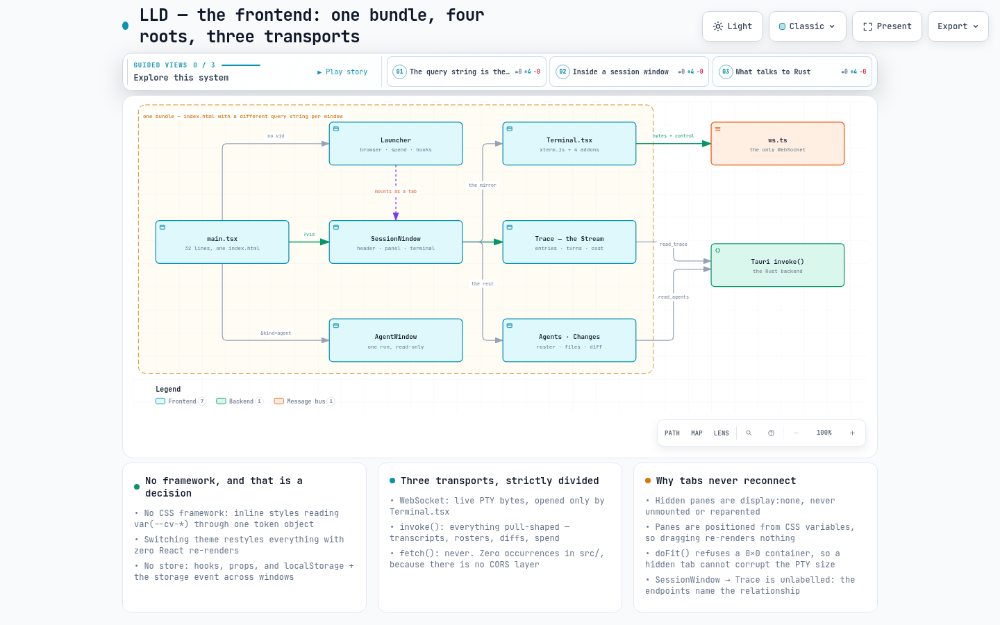
</picture>

*One bundle, four roots chosen by query string, three strictly divided transports* — **[open the interactive version ↗](https://quantum-vik.github.io/claude-view/diagrams/lld-frontend.html)**


`src/main.tsx` is 32 lines. It calls `initTheme()` **at module scope**, before `createRoot`, so the theme's CSS custom properties are on `:root` before the first paint — no white flash, no unthemed frame. Then it reads `window.location.search` and renders exactly one of four roots. Nothing navigates afterward.

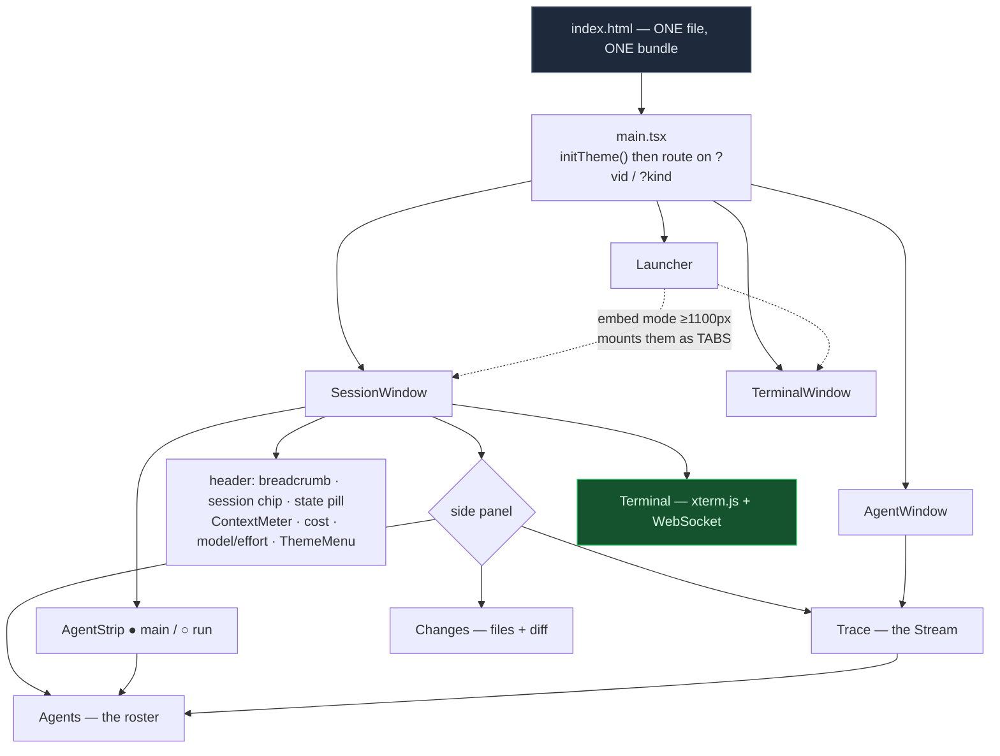

### 5.2 Styling: no framework, on purpose

There is no CSS framework, no CSS-in-JS runtime, no Tailwind, no component library. Components carry **inline style objects**, but every colour value is a `var(--cv-*)` reference obtained from the `T` object in `tokens.ts`. `themes.ts` converts a `Theme` into **40** custom properties and writes them onto `document.documentElement`.

**The consequence is the reason for the indirection: switching themes restyles the entire app instantly, with zero React re-renders.** The only consumer that cannot read CSS variables is xterm.js, so `Terminal.tsx` subscribes to `onThemeChange()` and reassigns `term.options.theme` live. A `localStorage` write propagates the choice to every other window through the `storage` event.

Typography follows one stated rule: **serif (Lora) for human language, mono (IBM Plex Mono) for machine language.** Prompts, assistant messages and thinking are serif; tool names, commands, output, timestamps, durations and token counts are mono. A tool's error message is mono; a sentence Claude wrote *about* it is serif.

`src/ui/` holds exactly three primitives — `Button` (chip / quiet / link), `Stat`, `EmptyState` — because its stated bar is that **a shape must already exist in two places and have drifted, or be about to.** A survey found 48 `cursor: pointer` blocks across 10 files and deliberately left them alone: forcing them through one component would mean a prop per difference.

### 5.3 State: no store, on purpose

No Redux, no Zustand, no Context. Everything is React hooks, plus three hand-rolled shared data hooks:

| Hook | Command | Cadence | Note |
|---|---|---|---|
| `useTrace(vid)` | `read_trace` | 1200 ms | Cursor-paged, 500 entries/page, looped until `hasMore` (guard: 200 pages) |
| `useRoster(vid)` | `read_agents` | 1500 ms | Holds a vanished run for **2 polls**, so a spawning subagent's row does not blink out |
| `useCommitSpans(vid)` | `read_changes` | **once** | Never polled — *"a diff is reviewed rather than watched"* |

The one piece of genuinely global state lives **outside React**: the theme module keeps a module-level `current` and a `Set` of listeners.

**Cross-window** state travels through `localStorage` plus the `storage` event — 12 `cv.*` keys covering tabs, active tab, pane layout and split fractions, list and sidebar widths, panel choice, terminal font size, skip-permissions, and current/custom themes.

**Cross-component** state travels through props, deliberately: `agentScope` is held in `SessionWindow` *above* both the Trace and the roster, so flipping panels keeps the filter — *"a filter that silently resets on a tab change is worse than no filter."*

### 5.4 Transport: three channels, strictly divided

| Channel | Used for | Where |
|---|---|---|
| **WebSocket** — exactly one | Live PTY bytes (binary, both ways) and push control JSON (text) | Opened **only** by `Terminal.tsx`; `ws.ts` is a 121-line class with 500 ms→5 s exponential reconnect that stops once an `exit` frame has been seen |
| **Tauri `invoke()`** | Everything pull-shaped: ~20 commands | Every panel and the launcher |
| **`fetch()` / XHR** | **Never.** Zero occurrences in `src/` | The webview is a different origin from the local server, which has no CORS layer. `GET /trace/:id` stays alive for scripting; the UI does not touch it |

### 5.5 The terminal

`Terminal.tsx` mounts one xterm.js instance over a 20,000-line scrollback with `allowProposedApi`, loading Fit, Search, Unicode11 and WebGL (in a try/catch, with canvas fallback and context-loss disposal). On top of that:

- **A custom always-visible scroll roller** — macOS overlay scrollbars are invisible over the WebGL canvas.
- **Capture-phase ⌘/Ctrl+click** path and URL opening that works even while the mirrored TUI swallows plain clicks.
- **`doFit()` refuses to fit a 0×0 container.** A tab mounted while `display:none` would otherwise compute 0 cols/rows and corrupt the PTY size shared by every viewer.
- **`detectDialog(lines)`** — pure and exported: a caret-marked numbered option in the bottom 20 rows, **vetoed** by a live *"esc to interrupt"*, **corroborated** by two options or a confirm affordance. It is **biased toward false negatives**, because an incorrectly "blocked" session poisons the launcher's triage view. The scan is off by default per window, runs only when the viewport is at the live bottom, is rAF-throttled behind a 200 ms settle, and is **edge-triggered** — plus reset on every reconnect, which forces a re-send.

### 5.6 Notification policy

`turn_done` and `attention` are **held, not fired**: a 1 s cancellable hold, dropped if a later `agent_state` transition (higher `seq`, different state) says the situation changed. Each kind has its own 5 s throttle, so *"Claude needs you"* can never be swallowed by *"Claude is done."* `exit` is terminal and goes straight out.

The focus gate is `kind !== "attention" && document.hasFocus() && isVisibleRef.current` — **both conjuncts**. `document.hasFocus()` alone is insufficient because every tab lives in one document, so it is true for a session buried three tabs deep; `isVisible` is the extra signal. `attention` pings ignore the gate entirely.

### 5.7 The model switcher

`/model` and `/effort` are **typed into the PTY like a person would**, as single writes 200 ms apart — measured: 20 ms is the smallest reliable gap, 0–10 ms loses the second command. Injection is **refused** while the agent is working, blocked, or ended, because otherwise it would append to a live turn or answer a permission dialog.

### 5.8 Frontend rules worth stating

- **Dragging never re-renders.** Every resizable boundary coalesces pointer moves into one rAF, writes straight onto the DOM node or a CSS variable, and commits to React state + `localStorage` only on release. (`Resizer.tsx` uses pointer capture so a release off-window is never lost; the launcher's `PaneDivider` uses window-level mouse listeners.)
- **Absence is reported by cause, never as "nothing to show."** `EmptyState` takes a heading *and* a body precisely so each caller must name which of its causes this is — *"this session is older than git's memory."*
- **Colour is never the only signal.** Live vs Live? differ in **word**, not shade. Status pills render a dot **and** the word. `ContextMeter` is a real `role="progressbar"` with `aria-valuetext`, not a tooltip-only span.
- **The Stream's direction is derived, never a setting**: newest-first while a session is live, oldest-first once it has ended — and when it flips, the **row** at the top of the viewport is preserved, not the pixel offset.
- **Poll cadences are justified by measurement**, not guessed: 1200 ms trace / 1500 ms roster (the transcript lands 0.135–0.244 s after the event), 2000 ms session list, 1500 ms watched liveness. Anything expensive or review-shaped is fetched **once** instead.
- **Money is priced in TypeScript only.** Rust sends token counts; `pricing.ts` holds the table and its `AS_OF` date. A second copy in Rust would be a second source of truth.

---

## 6. The interface catalogue

### 6.1 Tauri IPC — 24 commands (the primary contract)

| Command | Signature | Notes |
|---|---|---|
| `new_session` | `{cwd, resume?, continueLast?, skipPermissions?, openWindow?} → SessionInfo` | **`skipPermissions` defaults to `true`**, `openWindow` to `true` |
| `new_terminal` | `{cwd, kind?: "tmux"\|"shell", openWindow?} → SessionInfo` | No permission parameter exists; a shell has no permission model |
| `watch_session` | `{cwd, sessionId, openWindow?} → SessionInfo` | Adopts a session claude-view did not launch. `started_at` comes from the **transcript's** created/modified time, not the click |
| `close_session` | `{viewerId} → ()` | Registry remove + kill. Infallible signature; the *"only for ended sessions"* rule is frontend discipline |
| `focus_session` | `{viewerId} → Result` | Focuses `session-<vid>`, else rebuilds it from the registry |
| `dock_session` | `{viewerId} → Result` | Emits `cv:dock` to `main` and closes the window — **only if a launcher webview already existed** |
| `open_agent_window` | `{viewerId, agentId} → Result` | Label `agent-<vid>-<agentId>`; focuses instead of stacking |
| `list_sessions` | `() → SessionInfo[]` | Sorted by `cwd` |
| `list_past_sessions` | `() → PastSession[]` | The `~/.claude/projects` scan |
| `delete_past_session` | `{sessionId} → Result` | Moves to OS Trash |
| `get_conn_info` | `() → {port, token}` | How the launcher embeds a viewer |
| `read_trace` | `{viewerId, after?, limit?} → TracePage` | **Typed absence, never an Err** — a malformed cursor is now `unavailable: "bad_cursor"` too |
| `read_agents` | `{viewerId} → Roster` | Same typed-absence shape |
| `read_changes` | `{viewerId} → ChangeSet` | Baseline = HEAD as it stood at session start |
| `read_patch` | `{viewerId, path} → string` | One file's unified diff, fetched lazily |
| `session_liveness` | `{viewerId} → Liveness` | Polled by watched windows — nothing pushes for them |
| `session_spend` | `() → Spend` | Takes **no** session argument: a machine-wide question |
| `export_trace` | `{viewerId, format, dest, agent?} → {path, bytes, entries, turns}` | Reads the **whole** trace (≤500 pages) before filtering; Rust writes the file |
| `open_path` | `{path, cwd?} → Result` | Canonicalizes, refuses executables, prefers `code -g`, allowlists extensions |
| `open_url` | `{url} → Result` | http(s) only; rejects `\n \r \0 "` |
| `notify` | `{title, body, sound?} → Result` | Sound restricted to a fixed set |
| `hooks_status` / `install_hooks` / `uninstall_hooks` | `() → bool` / `Result<String>` / `Result<String>` | Install is idempotent and additive |

**One backend → frontend event:** `cv:dock` with `{vid, cwd, isTerminal}`, emitted to the `main` window. It is the only event subscription in the app.

### 6.2 HTTP — 8 routes on `127.0.0.1:<ephemeral>`

| Route | Auth | Purpose |
|---|---|---|
| `GET /ws/:id` | **`?token=` only** — a correct header with no query param is a 401 | The live spine. `:id` may be a viewer id *or* a session id |
| `POST /hooks` | `X-Claude-View-Token` | Every hook event. Unknown session → quiet 200 |
| `POST /bind` | header | Explicit binding for custom bridges. **The bundled bridge never uses it** — `/hooks` binds implicitly |
| `GET /sessions` | header | Live `SessionInfo[]` |
| `POST /sessions` | header | Launches a session **and its window**. A present-but-non-boolean `skip_permissions` is a **400**, not a guess in either direction |
| `POST /terminals` | header | Same for a shell/tmux window |
| `GET /past_sessions` | header | The scan, on `spawn_blocking` so the filesystem walk never stalls the executor |
| `GET /trace/:id` | header **or** `?token=` | Paged trace |
| `GET /changes/:id` | header **or** `?token=` | Change set; `?path=` switches to `{path, patch}` |

`skip_permissions` defaults to `true` through an **explicit function** rather than `#[serde(default)]`, because `bool::default()` is `false` and the derive would turn a documentation change into a silent security-posture change for every scripted caller.

### 6.3 The WebSocket protocol

**Binary = bytes. Text = JSON control.** In both directions.

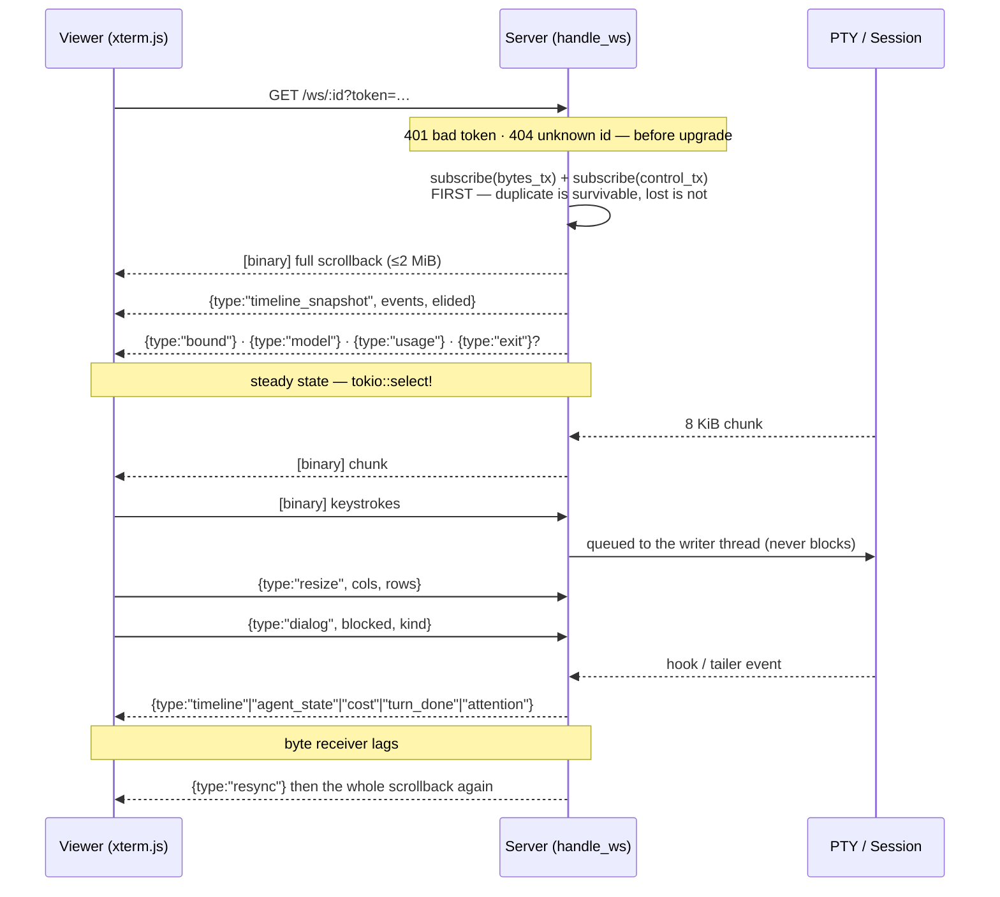

| Server → client (text) | Payload | Source |
|---|---|---|
| `timeline_snapshot` | `{events[], elided}` | connect replay |
| `timeline` | `{event: TimelineEvent}` | hooks **and** the transcript tailer; upsert by id |
| `bound` | `{session_id, cwd}` | on (re)bind |
| `agent_state` | `{state, reason, seq, since}` | the merged state machine |
| `turn_done` | — | the `Stop` hook |
| `attention` | `{message}` | the `Notification` hook |
| `model` | `{model}` | **the tailer**, not a hook — CLI ground truth |
| `usage` | `{input, output, breakdown}` | the tailer *(the connect replay omits `breakdown`)* |
| `cost` | `{rollup}` | the tailer, only when totals actually move *(not replayed on connect)* |
| `resync` | — | only after a lagged byte channel |
| `exit` | `{code}` | the PTY waiter thread |

**Client → server:** binary keystrokes, `{type:"resize"}`, `{type:"dialog"}`. That is all.

**Bounded memory everywhere a viewer or an agent can push:** scrollback 2 MiB (+256 KiB slack, cut on a line boundary), timeline 5000 cards, card subject 2048 chars, tool output 4000 chars, dialog kind 32 chars, trace text 4000 chars.

---

## 7. Data model

### 7.1 On disk — what Claude Code writes and claude-view reads

```
~/.claude/
├─ projects/<slug>/
│  ├─ <session-id>.jsonl                      the parent transcript, one JSON object per line
│  └─ <session-id>/subagents/
│     ├─ agent-<agentId>.jsonl                one per subagent run — FLAT, however deep the nesting
│     └─ agent-<agentId>.meta.json            {toolUseId, parentAgentId?, agentType?, description?, spawnDepth?}
│                                             written ~33ms BEFORE the child's first transcript line
├─ settings.json                              claude-view merges 7 hook entries here
├─ settings.json.claude-view.bak              once-only 0600 pre-install snapshot
└─ claude-view/                               0700 — written by claude-view
   ├─ claude-view-hook.sh | .ps1              the bridge, 0755
   ├─ instances/<port>.json                   0600  {port, token, pid}  ← the bridge's token source
   └─ instance.json                           0600  legacy shared copy
```

**Fields claude-view actually reads from a transcript line**, ignoring everything else:

```jsonc
{
  "type": "user" | "assistant" | "summary",
  "timestamp": "2026-07-10T17:34:34.014Z",   // UTC only — a numeric offset fails to parse and becomes 0
  "cwd": "/path",                             // present on most records; read only from the head
  "requestId": "req_…",                       // the de-dup key — billing is per API request
  "uuid": "…", "isMeta": false, "isSidechain": false,
  "sessionId": "…", "agentId": "…",
  "toolUseResult": { "persistedOutputPath": "…", "status": "completed" | "async_launched", "resolvedModel": "…" },
  "message": {
    "id": "msg_…", "model": "claude-opus-5",
    "usage": { "input_tokens": 0, "cache_read_input_tokens": 0,
               "cache_creation_input_tokens": 0,
               "cache_creation": { "ephemeral_5m_input_tokens": 0, "ephemeral_1h_input_tokens": 0 },
               "output_tokens": 0 },
    "content": "…" | [ {"type":"text","text":"…"}, {"type":"thinking","thinking":"…"},
                       {"type":"tool_use","id":"…","name":"Bash","input":{}},
                       {"type":"tool_result","tool_use_id":"…","is_error":false,"content":"…"} ]
  }
}
```

`toolUseResult.persistedOutputPath` is surfaced onto the `Entry` so the panel can fetch full, untruncated output on demand — **the thing that lets the panel be more complete than the terminal.**

### 7.2 Shapes that cross a boundary

| Shape | Casing | Where |
|---|---|---|
| `SessionInfo` | **snake_case, no renames** — the field names *are* the wire contract, pinned by two tests | `list_sessions`, `new_session`, `watch_session`, `GET /sessions` |
| `TimelineEvent` | camelCase renames (`durationMs`, `agentId`) | `timeline` WS frames |
| `CostRollup` | camelCase renames (`byModel`, `subagentTotal`) — **carries no dollar figure** | `cost` WS frames |
| `TracePage` / `Entry` | camelCase, `skip_serializing_if` on every Option | `read_trace`, `GET /trace/:id` |
| `Roster` / `AgentRun` | camelCase | `read_agents` |
| `ChangeSet` / `ChangedFile` / `CommitSpan` | camelCase; `unavailable` omitted entirely on success | `read_changes`, `GET /changes/:id` |
| `Spend` / `Bucket` | camelCase — **no dollar figure** | `session_spend` |
| `PastSession` | **mixed** — explicit renames give `modifiedMs`, `contextTokens`, `repoKey` beside snake_case `session_id` | `list_past_sessions` |
| `Liveness` | internally tagged: `{"state":"live","tool":"Bash"}` | `session_liveness` |

**The trace cursor** decodes to `{"": 13421, "a1705fdcf7a898a7e": 4096}` — parent keyed by the empty string, subagents by agent id — base64url-encoded without padding. Empty string means start-of-session; anything outside the alphabet is rejected as `unavailable: "bad_cursor"` rather than silently treated as position 0, which would replay the whole session.

---

## 8. Runtime flows

### 8.1 Launching a session

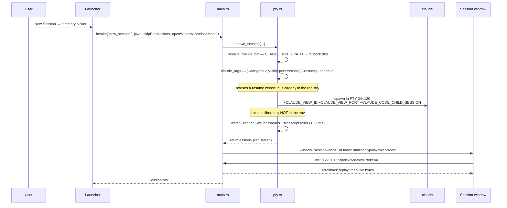

### 8.2 A tool call becoming a timeline card

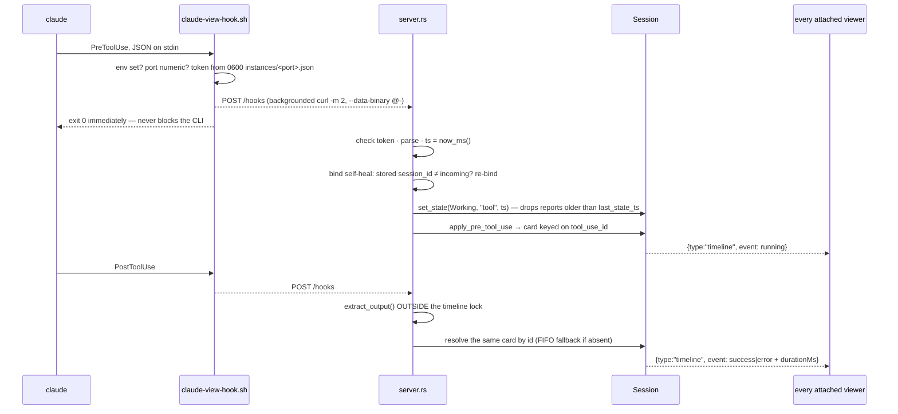

### 8.3 Watching a session claude-view did not launch

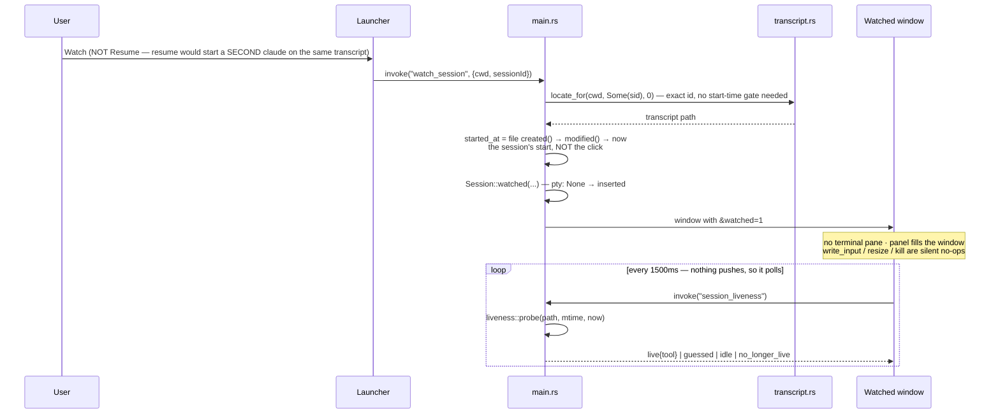

### 8.4 The Changes view

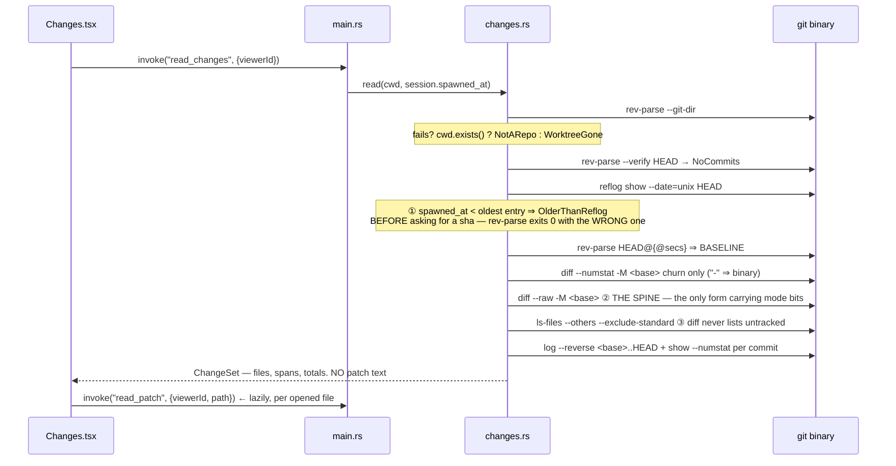

### 8.5 Theme switching

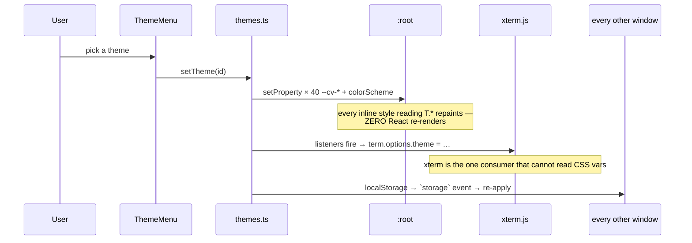

---

## 9. Cross-cutting design rules

These recur across modules and are the load-bearing ideas of the codebase.

### 9.1 Typed absence, never an empty success

`read_page` returns `Result<TracePage, Unavailable>` with two failure variants; `read_roster` reuses it; `ChangeSet` carries five (`NotARepo`, `WorktreeGone`, `NoCommits`, `OlderThanReflog`, `NoGit` — serialised as `git_unavailable`, the name the panel already keys on). Every boundary turns these into an **HTTP 200 / `Ok`** carrying `{unavailable: <which>}` rather than an error, because the UI must be able to say *which* failure occurred. The rule as the source states it:

> Rendering "nothing happened" for "I cannot see" is a lie the viewer has no way to detect.

A session that genuinely changed nothing is a **success** with an empty list.

### 9.2 Replay detection: one fold, three call sites

Two duplication problems converge on one mechanism.

- **Within a file:** Claude Code writes **one record per content block**, each repeating the same `message.usage`. Summing per record inflates totals **1.00×–3.57×, median 2.12**.
- **Across files:** a *resumed* session replays earlier turns verbatim into a brand-new transcript with the same `requestId`.

The answer to both is a fold keyed `requestId` → `message.id` → `uuid`, **last-wins** and **global**.

- **Last-wins**, because the input side is byte-identical across a turn's records (**0 of 1,258 groups differed**) while `output_tokens` *grows* — 283 groups, every one in a subagent transcript. Taking the first record undercounts corpus output by **27.9 %**.
- **Global**, because a per-file fold would still double-count a replay.

Three call sites implement it for their own scope: `UsageLedger` (live), `read_roster` (surfacing `duplicatesFolded` as a resume signal), `rollup::scan` (surfacing `duplicatesSkipped`). The trace pager deliberately does **not** globally dedupe — its `turns` map is last-wins *within a page*, because the trace is positional, not a total.

### 9.3 Tokens are Rust's; dollars are TypeScript's

Rust owns the tailer and therefore the de-duplication, so it counts tokens and only tokens. `Roster`, `Spend`, `CostRollup` and the JSON export all carry `TokenUsage` and **no dollar figure anywhere**. Pricing happens in `src/pricing.ts`, which carries an `AS_OF` date the UI surfaces.

**Every dollar figure is notional** — what the tokens would have cost at published API list prices. On a Claude subscription you are billed a flat rate, so these are not bills, and the `CAVEAT` object supplies the exact strings the UI must use. An **unknown model returns `null`, never zero and never a family-prefix guess**: adjacent releases within one family differ by up to **4× on cache read**, so the fallback would be most wrong exactly when it is used. Unpriced turns are counted and the total is labelled understated.

A run is costed at **its own** model's rate, not by a session-wide token proportion: on the reference session the haiku run made the most tool calls of any run for **$0.113**, against opus runs up to **$3.715**.

### 9.4 Two signals merged, never mixed

<picture>
  <source media="(prefers-color-scheme: dark)" srcset="diagrams/lld-session-state-dark.png">
  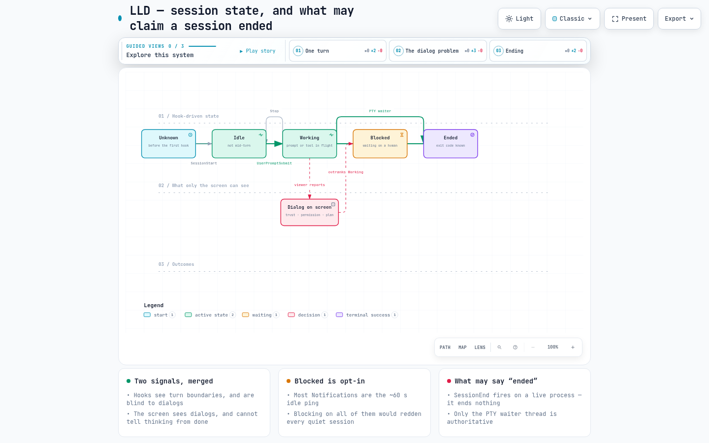
</picture>

*Hook state and screen state live in two fields precisely so they cannot overwrite each other* — **[open the interactive version ↗](https://quantum-vik.github.io/claude-view/diagrams/lld-session-state.html)**


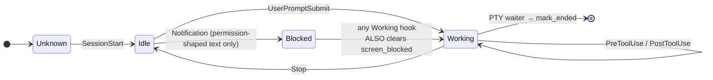

Hooks are ground truth for **turn boundaries** but blind to dialogs. The screen sees **dialogs** but cannot tell thinking from finished. They live in two independent fields — `state` and `screen_blocked` — and `merge_state` combines them:

- A terminal always passes its hook state straight through.
- Otherwise **any dialog on screen forces `Blocked`, even over `Working`** — a permission prompt is precisely what interrupts a running tool, so the older signal must not win.
- **Any `Working` hook clears `screen_blocked`** — including a `Working → Working` no-op, *which is exactly the transition a permission prompt is answered on*. That is how an answered prompt self-resolves even if the window has been closed.

`AgentState` comes from the agent's own process, not a screen scrape, so there is no debounce and no confirmation hold. `set_state` gates its broadcast on the **effective** state changing, so a `Stop` behind a dialog does not reset every viewer's *"blocked for 2m"* clock.

### 9.5 Pure cores, testable boundaries

The decisions with real consequence are deliberately extracted into free functions that take plain data, because the thing they live inside cannot be constructed in a test:

| Function | Extracted from | So that |
|---|---|---|
| `claude_args` | the spawn path | the `--dangerously-skip-permissions` decision is table-tested without a real `claude` |
| `apply_pre_tool_use` / `apply_post_tool_use_with_output` / `settle_running` | `Session` | correlation, error inference and eviction are testable without a live PTY |
| `merge_state` / `push_timeline` | `Session` | the precedence table and the eviction rule are testable as data |
| `liveness::probe` | the clock | `now` is a parameter, so every boundary is directly asserted |
| `detectDialog` | React | the screen scanner is a pure `string[] → DialogState` |

### 9.6 Measurement over instinct

Nearly every constant in this codebase has a number behind it, and the comment next to it usually records the number:

| Decision | The measurement |
|---|---|
| Nothing is cached | Largest real transcript: 13.06 MB / 4,688 lines, parses in **46 ms** |
| `LIVE_MS = 180 s` | Over **2,507 tool calls**, 60 s misjudges 26; 180 s misjudges exactly 1 |
| `WRITING_MS = 20 s` | p90 inter-record gap is 10.5 s |
| Split token kinds | Collapsing them overstates an Opus 5 session **7.2×** (~97 % of input is cache reads) |
| Last-wins dedup | First-wins undercounts corpus output **27.9 %** |
| Global dedup | Per-record summing inflates **1.00×–3.57×, median 2.12** |
| Subagent spend is in the ledger | Measured at **64.2 %** of one real session; 1.79× the parent on another |
| Hide `/tmp` sessions | **21 of 24** project dirs on one machine were throwaways |
| Middle-truncate run labels | Right-truncation left **7 of 11** descriptions distinct; middle-truncation left **11 of 11** |
| 200 ms between injected commands | 20 ms is the smallest reliable gap; 0–10 ms loses the second command |
| Trace poll 1200 ms | The transcript lands **0.135–0.244 s** after the event |
| Chunk-size limit 800 kB | Measured 709 kB: xterm 428 (60 %), react 142, app 135, tauri 1.4 |

---

## 10. Build, test, package, release

### 10.1 The one structural fact

`tauri.conf.json` sets `frontendDist: "../dist"`, and `dist/` is gitignored. `generate_context!()` reads that directory **at compile time**, so on a clean checkout **no cargo command works at all** — not `cargo check`, not `clippy`, not `test` — until the frontend has been built. That is why `build` is a prerequisite of the whole pipeline, and why even the Windows CI job, which never runs a test, still does `npm ci && npm run build` before `cargo check`.

### 10.2 `just` recipes

| Recipe | What it does |
|---|---|
| `just build` | `npm ci` + `npm run build` (= `tsc && vite build`) → `dist/`. **Prerequisite of everything** |
| `just lint` | `npx tsc --noEmit`, then `cargo fmt --check` and `cargo clippy --all-targets --locked -- -D warnings` |
| `just fmt` | `cargo fmt` |
| `just test` | `cargo test --locked` — 162 tests |
| `just ci` | `build lint test` — **the single recipe CI invokes**, so local and CI runs cannot drift |
| `just dev` | `npm run tauri dev` (Vite on strict port 1420) |
| `just package` | `APPIMAGE_EXTRACT_AND_RUN=1 npm run tauri build -- --bundles deb,appimage` |
| `just package-arch-bin` / `just package-arch` | `makepkg` in the two packaging dirs |

`clippy` runs with `-D warnings` **and** `--all-targets`, so a warning anywhere — test modules included — fails the build.

### 10.3 CI

Two jobs in one workflow, on push-to-main and every PR, with `concurrency: cancel-in-progress` and `permissions: contents: read`.

- **`ci` (ubuntu-latest)** — apt-installs the Tauri v2 Linux prerequisites (`libwebkit2gtk-4.1-dev` and friends; Tauri links the *system* webview on Linux, which is why this step has no counterpart in the other job), Node 20, Rust stable + rustfmt/clippy, `Swatinem/rust-cache` scoped to `src-tauri`, `just`, then **`just ci`**.
- **`windows-check` (windows-latest)** — exists **solely** to keep `#[cfg(windows)]` code compiling: `hooks_install.rs` swaps its embedded bridge script and builds a `powershell -NoProfile -ExecutionPolicy Bypass -File …` command, and `pty.rs` has several `#[cfg(windows)]` branches *including inside its own test module*. The Linux job never compiles any of it. `--all-targets` is deliberate so test-only Windows code is type-checked too. It deliberately does **not** run the suite.

### 10.4 The sandbox wrapper

`packaging/sandbox/claude-view-sandboxed` exists because claude-view launches sessions with `--dangerously-skip-permissions` by default. Rather than trusting the agent, it narrows what *"files"* can mean:

```
--unshare-all --share-net      network stays: the CLI needs the API
--die-with-parent
--new-session                  blocks TIOCSTI keystroke injection back into the host tty
--ro-bind /usr /etc /opt /sys  + symlinks for /lib /lib64 /bin /sbin
--tmpfs /tmp
--tmpfs "$HOME"                ← the ENTIRE home directory disappears
  --bind ~/.claude             then exactly three things come back read-write
  --bind ~/.claude.json
  --bind "$WORKSPACE"
--ro-bind <claude install dir> resolved via command -v + realpath + dirname
```

**Two bind-mounts exist because things silently broke without them**, found by testing rather than by theory:

- `--ro-bind-try /run/systemd/resolve` — on systemd hosts `/etc/resolv.conf` is a symlink *into* `/run`. Without it, DNS fails silently and the CLI simply cannot reach the API.
- `--dev-bind /dev/dri` plus `--ro-bind /sys` — GPU for the webview, and the device metadata mesa reads. MESA errors went 7 → 0.

Measured effect: home directory entries visible to the sandboxed app go from **51 to 4**; sibling repositories are unreachable.

### 10.5 Packaging

| Target | How |
|---|---|
| `.deb` | Tauri bundler |
| `.AppImage` | Tauri bundler — **knowingly broken on modern Arch** and not shipped (see below) |
| `.pkg.tar.zst` | Two PKGBUILDs; Arch has no Tauri bundler target |

**`webkit2gtk-4.1`, never 4.0.** The ABI differs, and a 4.0-only system fails at *launch*, not at install — so both PKGBUILDs declare it and the packaging README leads with it.

**Two known build hazards, both recorded in-tree:** `APPIMAGE_EXTRACT_AND_RUN=1` is required on Arch because linuxdeploy is itself an AppImage using FUSE 2 while Arch ships only `fusermount3`; and the AppImage *still* fails because gdk-pixbuf2 2.44+ ships no `/usr/lib/gdk-pixbuf-2.0/2.10.0/` while pkg-config still advertises it, so `linuxdeploy-plugin-gtk` dies on `cp: cannot stat`, surfaced only as *"failed to run linuxdeploy"*. The known `PKG_CONFIG_PATH` workaround is deliberately **not** in the default recipe, because changing it invalidates the cargo cache and forces a full GTK recompile.

The two PKGBUILDs are the same package by two routes and must never both be installed — `claude-view-bin` declares `provides=('claude-view')` and `conflicts=('claude-view')`. Both set `options=('!strip' '!debug')`, because `[profile.release]` already does `strip = true`.

### 10.6 Testing

**162 `#[test]` functions across 14 of the 15 Rust modules** (`main.rs` has none), all as in-module `#[cfg(test)]` blocks. No `tests/` directory, no integration crate, **no `[dev-dependencies]` at all** — scratch dirs come from `std::env::temp_dir()` keyed by pid, explicitly to avoid a `tempfile` dependency.

Density tracks parsing risk: `server.rs` 21 · `instance.rs` 19 · `changes.rs` / `session.rs` / `transcript.rs` 15 each · `agents.rs` 13 · `hooks_install.rs` 11 · `liveness.rs` / `past_sessions.rs` 9 · `export.rs` / `rollup.rs` / `trace.rs` 8 · `git.rs` 7 · `pty.rs` 4.

Test names are full sentences describing behaviour: `a_session_older_than_the_reflog_has_no_baseline_rather_than_the_wrong_one`, `the_settings_backup_does_not_follow_a_planted_symlink`, `eviction_never_drops_a_running_card`.

Two special categories: **~7 "real corpus" tests** that scan `~/.claude/projects` and silently `return` when it is absent — so the suite is green on a CI runner and meaningful on a developer machine — and **`dump_*` tests gated on env vars** (`CV_DUMP_CHANGES`, `CV_DUMP_LIVENESS`, `CV_DUMP_ROSTER`, `CV_DUMP_TRACE`, `CV_DUMP_SESSIONS`) used as fixture generators for the prototypes, not as assertions.

**What is not tested** — stated plainly because it matters: the **entire frontend** (no vitest, no jest, no playwright, zero `*.test.*` under `src/`; its only static analysis is `tsc --noEmit`), `main.rs` (Tauri command wiring and app setup), the packaging scripts and PKGBUILDs, the bwrap wrapper, and every Windows code path (compiled by CI, never executed).

### 10.7 Release

The version string lives in **six files that must agree by hand** — `package.json`, `src-tauri/tauri.conf.json`, `src-tauri/Cargo.toml`, `src-tauri/Cargo.lock`, and both PKGBUILDs (plus `package-lock.json`, which npm updates itself). **Nothing in CI or the justfile verifies they match.**

Built packages (`.pkg.tar.zst`, `.deb`, `.AppImage`) are **gitignored and never committed**; the release trail is the git tag plus the GitHub release, with a `chore(release): <ver>` commit recording the bump.

### 10.8 Prototypes

`prototypes/<name>/` is a throwaway-UI convention answering **one design question each**, with a strict committed/generated split:

- **Committed:** `README.md` (the question *and the verdict*), `gen_fixture.py`, `build.py`, `template.html`, `.gitignore`.
- **Never committed:** `fixture.json` and `index.html` — they carry real, only-partly-redacted session content.

`gen_fixture.py` pulls a redacted fixture from a *real* local session; `build.py` substitutes it into the template at the literal marker `/*__FIXTURE__*/null`. Sometimes the generator re-implements backend logic independently as a cross-check — `agents-section` reimplements the turn fold and `src/pricing.ts` in Python and lands on the same **$164.12** the Rust ledger produces.

---

## 11. Known gaps

This section exists because a document that only describes intent is half a document. Everything below was found by reading the source for this write-up, and each item is real.

### 11.1 Behavioural

| Gap | Detail |
|---|---|
| **`focus_session` loses the watched flag** | Rebuilding a closed window re-derives only the `&kind=terminal` suffix from `is_terminal`; there is no `is_watched()` branch. A watched session whose window is closed and reopened from the launcher comes back as a *normal* session URL |
| **Post-baseline git failures are silent** | Only `baseline()` failure is typed. `churn()`, the `--raw` diff, `untracked()`, `spans()` and `head` all collapse errors into empty values — so a git failure after the baseline resolves renders as a **successful** `ChangeSet` with zero files, indistinguishable from *"the session changed nothing"* |
| **`spans()` can erase a whole commit** | The `it.next()?` calls sit inside the `filter_map` closure, so one malformed or blank `--numstat` line returns `None` for the entire `CommitSpan`, not just that line |
| ~~**`GitUnavailable` is a misnomer, and `date` is GNU-only**~~ | **Fixed in the backend revamp.** The `date` subprocess is gone (git takes the epoch directly), the variant is now `NoGit`, and `git()` distinguishes *could not run git* from *git ran and failed* — so a missing binary no longer reports `NotARepo` |
| **`liveness::scan_tail` can silently lose its best signal** | It uses `read_to_string`, so if the 400 KB window starts mid-codepoint the read errors, `scan_tail` returns `None`, and `probe` falls through to the clock ladder — losing the outstanding-tool-call evidence the whole module is built on. (`past_sessions::scan_tail` decodes lossily and does not have this problem.) A `tool_result` landing in the discarded partial first line likewise makes a completed call look outstanding |
| **`set_screen_blocked` broadcasts unconditionally** | Unlike `set_state`, it compares only the dialog *kind*, then bumps `state_seq` and rebroadcasts — so a session already `Blocked` by a Notification that then reports a dialog resets the viewer's *"blocked for Nm"* clock |
| **`dedup order decides attribution`** | The parent is scanned first and subagents after, so a turn key present in both files ends up attributed to the **child**, not the parent |
| **`rollup` uses a narrower key than `agents`** | `requestId` → `message.id`, with no `uuid` fallback. A usage-bearing record carrying neither is dropped from the machine-wide total entirely |
| **`hasMore` is not set on a torn final line** | A page over a live-written file can report `hasMore: false` with unread bytes on disk; correctness depends on the caller's next poll |
| **`Tailer` never prunes subagent tails** | A subagent read failure is silently ignored and the `SubTail` stays forever with a stale offset |
| **`parse_iso_ms` is UTC-only** | A timestamp with a numeric offset (`…+05:00`) fails to parse and the caller substitutes `ts = 0` |
| **`untracked()` hardcodes mode `100644`** | A newly created executable script reports the wrong mode |
| **`atomic_write`'s permission carry-over is late** | The temp sibling is created at the umask default and the **full `settings.json` contents — API keys included — are written into it** before `set_permissions` runs. A chmod-0600 `settings.json` is briefly readable at a predictable sibling path |
| **The hook toggle is blind to two settings files** | `hooks_install` only ever reads/writes `~/.claude/settings.json`. A hook block a user moved into `settings.local.json` or a project's `.claude/settings.json` is invisible to it and survives uninstall |
| **`doExport` has a stale-closure hazard** | Its `useCallback` dependency array is `[vid]` although the body closes over `scopeLocked` and `agentScope` — exactly the `agent:` argument that scopes the export |

### 11.2 Performance

- One `git show --numstat` subprocess **per commit** in the span — the main cost driver on a long session.
- The churn join is a linear scan of the churn `Vec` per raw row: **O(files²)**.
- `rollup.rs` reads each transcript **twice** (`cwd_of` does its own `read_to_string` on top of `scan_file`'s), and both load the whole file into memory.
- `read_page` re-runs subagent discovery on **every page** — a `read_dir` plus an open-and-parse-first-line per child, per request.

### 11.3 Process and documentation

- **No frontend tests at all**, against 21,098 lines of TypeScript.
- **Six version strings, no consistency check.**
- **`windows-check` has never been validated on a real Windows machine** — the workflow comment says so candidly.
- **`packaging/README.md` still says the AppImage "is not shipped in v1.0.0"** — a stale version reference in a tree at 1.6.0.
- **`docs/agents/handoff.md` claims 128 Rust tests**; there are now 162.
- The repo's own `.gitignore` documents a throwaway preview harness (`preview.html`, `src/dev-preview.tsx`) marked *"never commit"*.

### 11.4 Fixed while writing this document

- `.github/workflows/ci.yml` justified its Ubuntu-only runner with *"this is a PRIVATE repo, so Actions minutes are billed"*. The repo is public; standard runners are free. The **conclusion** (Ubuntu for the suite, Windows for `cargo check`) stands on runner speed and platform-neutrality, and the comment now says so, with the old billing reasoning kept as explicitly-dated history.
- `packaging/arch/PKGBUILD` still asserted *"this repo is private"* as live context.
- **`prototypes/session-diff/` and `prototypes/watch/` had no `.gitignore`**, unlike the three regularised prototypes, and the root `.gitignore` has no `prototypes` entry — so **312 KB of real, only-partly-redacted session content sat untracked-but-not-ignored in a public repository**, one `git add -A` away from being committed. Both now carry the same `.gitignore` as their siblings.

---

## Provenance

This document was produced by reading the source, not the existing prose. Nine agents each read one subsystem in full; nine more then re-opened the same files adversarially to refute what the first nine wrote, checking every signature, constant, path and line number. Their corrections are folded in — including several that contradicted the repository's own comments, and two that caught an edit made to `ci.yml` while the run was in flight.

Where a claim here disagrees with `README.md`, `CONTEXT.md` or `docs/agents/handoff.md`, **this document reflects the code as of v1.6.0** and those files are stale.

Line numbers are deliberately omitted from the prose: they were verified at the time of writing and will drift. Module names, type names, function names, constants and measured figures are the durable anchors.
